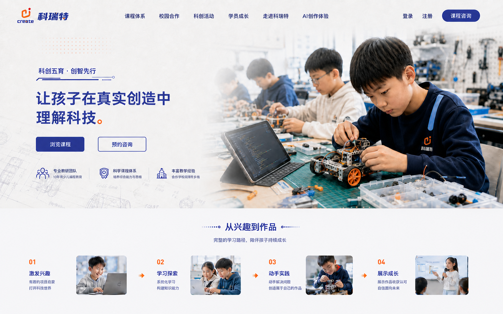

# 科瑞特 AI 全站设计规范

## 1. 设计权威

全站后续设计唯一母版是：

该母版定义视觉世界、影像气质、色彩、材质、标题尺度、导航关系和区块过渡。它是设计目标，不代表页面已经实现，也不把其中的概念人物、细节数字或示意文字自动认定为生产事实。

## 2. 核心视觉世界

页面应像一间明亮、真实、有成果的当代青少年科创工作室。

- 真实学生动手制作、编程、测试、展示的过程是主要视觉证据。
- 冷白纸张质感承载信息，工程草图、机器人结构线与浅橙点阵作为低对比背景细节。
- 品牌靛蓝负责标题、导航和关键结构，Logo 橙红只作小面积强调。
- 图片与文字通过自然曝光渐隐连接，不使用厚边画框或图片套卡片。
- 公开页面保持统一浅色主题，不在长页面中随意翻转为深色区块。

## 3. 锁定的首页首屏

- 透明底官方 Logo 位于导航左侧，只出现一次。
- 桌面导航单行、高度 64-72px，与首屏背景自然连续，无黑色分割线。
- 左侧品牌口号为“科创五育，创智先行”，搭配母版中的靛蓝技术线条符号。
- 首页主标题为“让孩子在真实创造中理解科技。”，桌面端最多两行。
- 主行动为课程浏览，次行动为课程咨询或校园合作。按钮文字必须保持单行。
- 右侧以少年在工作台组装轮式机器人为主视觉，并保留同伴、代码与工具环境。
- 左侧价值说明使用小型线性图标和短句，不放入独立圆角卡片。
- 首屏与下一部分采用平直、柔和的水平过渡，不使用撕纸、波浪、曲线切割或缝线边缘。
- “从兴趣到作品”使用四段真实图片路径：激发兴趣、学习探索、动手实践、展示成长。

## 4. 色彩

- 页面底色使用带轻微冷感的非纯白，避免大面积纯白造成扁平感。
- 靛蓝是唯一主强调色，橙红用于 Logo、步骤序号、箭头和少量视觉落点。
- 不使用荧光绿、通用 AI 紫色渐变、霓虹光晕或大面积纯黑。
- 正文采用深蓝灰，辅助文字保持足够对比度。
- 阴影只用于必要的媒体层次，必须轻柔并带蓝灰色调，不使用纯黑硬阴影。

## 5. 字体与标题

- 采用现代中文无衬线字体，优先思源黑体或 Noto Sans SC；实现时使用已授权的本地或构建字体资源。
- 首页标题桌面端 52-64px，其他页面标题 44-56px，均不得依靠超大字号制造设计感。
- 中文标题必须人工控制行宽与断行，禁止第二行只剩一两个字。
- 正文行长控制在约 32-38 个汉字，区块说明保持简短。
- 英文眉题不是默认装饰；全页平均每三个区块最多使用一次。
- 页面可见文案不得使用后台、接口、并发、账户权益、匿名结果等技术实施语言。

## 6. 图片与内容

- 首页、课程体系、创作空间、校园合作、科创活动、学员成长、咨询与走进科瑞特都必须有内容相关图片。
- 《AI科瑞特手册》67 页是全站内容清单：其中的品牌、理念、课程、教学方法、活动、赛事、成果、合作与联系信息都必须映射到适合的公开页面或详情层级，不得因新版式而遗漏。实施前建立“手册页码 → 网站页面/区块 → 文案/媒体 → 完成状态”的覆盖矩阵。
- 网站不得直接嵌入整页 PDF、原版手册页面或未经重构的原图。照片类课程与场景媒体应依据手册事实和视觉内容，为具体版位重新生成或制作桌面、平板、手机所需比例；文字使用可访问的原生 HTML，不烘焙进图片。
- 事实性人物、学校、Logo、证书、奖项与合作案例必须能追溯到《AI科瑞特手册》、已授权媒体或已发布数据。生成图不得冒充具体真实人物、学校、奖项或合作现场。
- Logo、证书、二维码等要求精确识别的资产不用生成模型仿造：应从授权资料无损提取、透明化重排、按官方矢量重构，或依据真实目标重新编码。二维码必须在桌面与手机真机复测可扫描。
- 每项新媒体都需记录来源页码、用途、目标尺寸/比例、主体安全区、移动端裁切、替代文本和生成/重制方式。
- 图片优先使用通栏、跨栏、自然裁切、软边渐隐、编辑式拼接和图文穿插。
- 不在图片上叠加装饰标签、内部状态或来源说明。
- 同一张 AI 音乐图不得复用于无关课程和页面。

## 7. 布局与容器

- 内容优先通过留白、分栏、连续信息带、编辑式目录、图集和时间线组织。
- 卡片仅用于真正独立、可点击、可选择或需要浮层层级的内容。
- 禁止三张等宽圆角功能卡连续排列。
- 禁止卡片套卡片、图片套框再套文字框的多层容器。
- 图片默认不加粗描边；媒体圆角控制在 8px 左右，按钮圆角约 10px，弹窗可使用 18px。
- 每个主要区块应形成完整节奏，不在常见视口中露出尴尬的半截标题或半截组件。

## 8. 各页面延展

### 8.1 课程体系

参考 B 方案的编辑式课程索引。以课程文字、真实或生成的课程主题图和局部图片切片共同组织编程、3D 建模、人工智能、无人机、机器人与综合科创，不使用空白搜索框或后台说明充当内容。

### 8.2 AI 创作空间

将工具组织成可扩展的媒介目录、作品画廊或分层工具架。AI 音乐、AI 绘画、AI 编程、AI 阅读与视觉拥有独立主题图片；音乐基础练习属于 AI 音乐内部。

### 8.3 校园合作

以已合作学校案例、真实课堂、合作成果和授权 Logo 为主。合作方式放在页面末尾，通过弹窗完整展示手册第 67 页的联系内容：品牌名“AI科瑞特青少儿科创机器人编程”、徐汇区浦北路 1077 号 2 楼、上海市徐汇区龙文路 69 号 2 层、电话 19921536568、“详情微信咨询”二维码和“关注公众号”二维码。不再使用联系方式占位符。

### 8.4 学员成长与科创活动

采用作品图集、过程叙事、时间线与精选故事。奖项、证书与竞赛图片不套厚重圆角框，所有媒体保持正常文档流并适配移动端。

### 8.5 课程咨询与走进科瑞特

咨询页使用真实学习场景建立信任，表单保持清晰、可访问，并提供第 67 页的真实电话、地址、微信咨询与公众号入口。走进科瑞特将手册全部相关内容转化为品牌叙事、发展历程、教学理念、荣誉、合作与联系信息，不直接嵌入 PDF 截图框。

### 8.6 登录与注册

默认使用全站弹窗承载，在弹窗内切换学校课堂、个人登录与注册。弹窗保持明亮、克制、可关闭、可键盘操作，并保留独立路由兼容外部链接。

## 9. 动效

- 动效强度为 5/10，只用于层级、故事顺序、操作反馈和状态变化。每页最多设置一个主视觉动效，其他动效保持辅助地位。
- 首选从 [React Bits 官方组件库](https://reactbits.dev/get-started/index) 选择与场景匹配的免费动效源码，按项目现有 React 技术栈复制并适配，不套用其默认视觉皮肤，也不为使用组件而改变锁定母版。
- 优先评估轻量的内容显现、淡入、媒体揭示与局部交互：首屏只做一次有节奏的图片和文字入场；课程、作品、合作案例只在首次进入视口时分组出现；项目画廊可在不损害可读性的前提下使用局部图像过渡。
- 接入前逐项记录 React Bits 组件名称、官方链接、依赖、许可声明、修改内容、移动端退化方式和性能结果。项目需保留其 MIT + Commons Clause 许可要求；不得使用未获授权的 Pro 内容。
- 100-150ms 用于按压/悬停反馈，150-300ms 用于常规过渡，300-500ms 用于布局与弹窗，首屏焦点序列可为 500-800ms。优先只动画 `transform` 与 `opacity`。
- 弹窗使用短距离淡入与缩放，按钮有轻微按压反馈。内容在 JavaScript 或动效失败时仍默认可见。
- 不使用滚动劫持、持续晃动、无意义视差、多个跑马灯、跟随光标特效或装饰性循环动画；普通内容页不引入重型 WebGL 依赖。
- 所有非必要动效尊重 `prefers-reduced-motion`，并在目标手机和常见桌面设备上验证帧率、滚动稳定性与输入响应。

## 10. 响应式与可访问性

- 桌面端重点核验 1366×768、1440×900 与 1920×1080；移动端重点核验 390px 宽度。
- 首屏主要信息与行动在常见桌面视口内形成完整画面，不使用固定 `100vh` 强行裁切。
- 移动端图文改为严格单列，标题最多三行，按钮不得断行，图片焦点保持可见。
- 导航在空间不足时进入清晰的移动菜单，不允许桌面导航换成两行。
- 所有交互支持键盘、可见焦点、语义标签、替代文本和 WCAG AA 对比度。

## 11. 明确禁止

- 荧光绿主色、大面积纯蓝色块、纯黑描边和新粗野主义厚边。
- 通用 AI 紫色光晕、玻璃拟态堆叠和无内容意义的渐变。
- 巨型三行或四行标题、孤字换行和首屏按钮被裁到下一屏。
- 三等分圆角卡片、连续等高卡片、卡片套卡片。
- 不规则撕纸边缘、波浪分区、橙色缝线和装饰性曲线切割。
- 用生成图冒充真实学校、学员、教师、证书、奖项或合作案例。
- 在公开页面显示运营、后台、接口、调用次数、匿名存储和开发占位状态。

## 12. 实施状态

设计母版已锁定，正式页面尚待按本规范实施。2026-09-03 的实施补充已纳入：手册内容全量覆盖、版位图片重制、第 67 页真实联系信息、React Bits 动效优先。实施完成后，可补充准确的组件尺寸、断点、字体文件、图片比例和动效参数，但不得在没有项目负责人明确确认的情况下改变母版级视觉方向。
