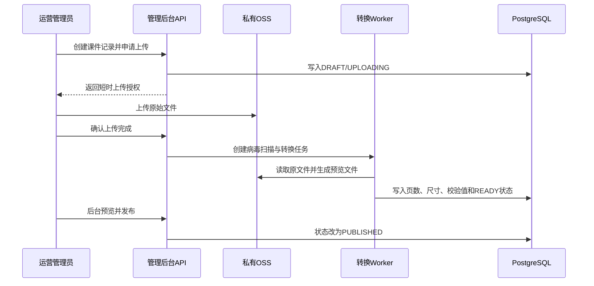

# 科瑞特 AI 主站与课程中心统一整改规划

> 文档状态：`[IN_PROGRESS]` 统一规划已进入实施，阶段性能力持续验收中  
> 创建日期：2026-09-02  
> 适用项目：`D:\programe\AI科瑞特\AI-create`  
> GitHub 地址：`https://github.com/ceason436-hue/AI-create`  
> 真实资料优先来源：`D:\programe\AI科瑞特\AI-create\长期记忆\AI科瑞特手册.pdf`  
> 正式应用：`ai音乐/ai-music-app`  
> 文档目的：统一规划主站、课程中心、学员学习中心、AI 工具中心、运营后台、课程课件和旧页面迁移，作为后续设计、开发、验收与内容补充的共同依据。

---

## 0. 文档定位与实施边界

本文件是页面层级与课程内容体系的统一整改方案，不是已经上线的功能说明。

### 0.1 代码仓库与阶段交付规则

- GitHub 地址：`https://github.com/ceason436-hue/AI-create`。该地址是本项目的正式 GitHub 代码仓库。
- 每个开发阶段或明确任务完成后，必须及时整理变更、提交 Git commit，并推送到上述 GitHub 远程仓库，确保远程仓库与阶段进度同步。
- 提交前应检查变更范围、运行与本阶段相关的必要验证，并在提交信息中清楚说明本阶段完成的内容；不得把多个已完成阶段长期滞留在本地未提交、未推送状态。

### 0.2 AI科瑞特手册：页面内容与图片的优先资料源

项目提供的 `长期记忆\AI科瑞特手册.pdf` 是制作网站页面时的真实信息优先来源。该手册共 67 页，包含品牌介绍、专家顾问、课程体系、课程培养目标、教学设计、奖项殊荣、证书资料以及相关图片内容。

使用规则：

- 主站、课程体系、走进科瑞特、校园合作、学员成长和课程内容优先从手册中整理真实文字与图片，不再先用虚构文案或无关图库替代。
- 手册中的图片可直接进入开发环境媒体库并用于页面；当前已将适合网页预览的手册页导出到正式应用 `public/handbook/`，来源和待确认状态需保留在内容数据中。
- 手册是视觉排版 PDF，部分页面不包含可直接提取的文本；遇到文字无法读取、图片不清晰、分辨率不足或比例不适配时，可以使用页面视觉核验、局部裁切、清晰化处理或生成同主题概念图补足。
- 生成图只能用于概念、装饰或结构占位，不得冒充手册中的真实教师、校区、课堂、合作学校 Logo、证书、奖项、学员或竞赛成果。
- 手册中的真实课程、专家、奖项、证书和学校 Logo 在开发/后台草稿阶段可以先展示；正式公开发布前，项目负责人仍需确认授权、个人信息脱敏、证书细节和最终展示范围。
- 页面或后台内容记录应标注资料来源，例如“来源：《AI科瑞特手册》第 5 页”，并对尚待确认内容使用 `[PENDING-CONTENT]` 标记。

本轮实施边界：

- 不删除 `code.html`、`minimax_docs.html`、`minimax_t2i.html` 或其他旧文件。
- 已在正式应用中新增独立主站、课程、学习中心、AI 工具目录和运营后台能力；既有工具接口和用户数据模型保持兼容。
- 手册页面素材仅导出适合网页预览的副本到 `public/handbook/`，原始手册和既有图片、音频、作品、课件不删除、不覆盖。
- 旧版页面和重复资源继续保留，待引用扫描、重定向、生产构建和浏览器验证完成后，再提交删除清单等待确认。

### 0.3 实施追踪（2026-09-02）

- `[DONE / Phase 0]` 已完成工作区基线检查、规划文档核对、手册 67 页资料核验和 GitHub 阶段交付规则记录。
- `[DONE / Phase 1 foundation]` 已建立课程分类、课程、模块、课时、报名、课程工具绑定、课件、内容、媒体和审计所需 Prisma 模型、首个增量迁移、公开 API、管理员 API 与后台入口；课程结构 API 会校验模块、课时和工具绑定所属课程，防止跨课程修改。
- `[DONE / Phase 4 foundation]` 已完成公开主站重构基础、公开课程/活动/成果/校园合作/走进科瑞特/咨询页面、主导航和响应式样式；手册第 5、7、8、10、11、12 页已作为开发素材导出。
- `[DONE / Phase 5 foundation]` 已建立 `/learn` 学习中心、报名有效期校验、学习进度接口、课程课时页和受限课件预览入口。
- `[IN_PROGRESS / Phase 6]` 已建立 `/tools` 双入口目录、旧工具 URL 重定向和匿名试用同网关受控分支；课程内打开工具会传递课程/课时上下文，AI 网关实时校验有效报名、已发布课时和工具绑定，文本与编程工具将已核验课时任务加入模型提示词。匿名请求使用随机请求标识并写入脱敏用量审计，不进入个人账户、作品或学习记录；Redis、供应商凭据和真实账户权益仍需部署环境验收，试用日历按 `AI_TRIAL_TIMEZONE` 配置（默认 `Asia/Shanghai`）。
- `[DONE / Browser smoke 2026-09-02]` 已使用真实开发应用验证桌面端首页、移动端 390px 首页与折叠导航、课程目录、工具目录、咨询页面、AI 绘画工作区和 `/ai-art` 到 `/tools/ai-art` 的旧地址重定向；发现并修复 Tailwind v4 语义样式扫描遗漏。
- `[IN_PROGRESS / Phase 2]` 已实现本地开发回退与私有 Aliyun OSS REST 存储驱动、课件原件受控上传、原件/预览对象分区、受保护预览会话、动态水印、处理队列、LibreOffice 转 PDF 处理端点及失败重试；新增 `node scripts/courseware-preflight.mjs`，可在不输出敏感值的前提下检查 OSS 驱动、必填环境键与 LibreOffice。生产环境仍需配置 OSS RAM、`COURSEWARE_WORKER_TOKEN`、定时调度和 LibreOffice，并以真实课件完成版式验收。
- `[IN_PROGRESS / Phase 3]` 运营后台现支持课件上传、预览处理状态、送审、发布、下线和失败重试；新增 `/admin/course-categories` 供运营人员维护课程一级/后续扩展分类的名称、介绍、排序和启用状态，`/admin/curriculum` 维护课程模块、课时、课时任务和 AI 工具绑定，并新增 `/admin/inquiries` 统一筛选和处理课程咨询、校园合作线索，状态变更写入审计。新增 `/admin/site-pages` 页面区块 CMS：可维护页面、区块、排序、主题、发布状态和 JSON 内容载荷；每次保存或恢复都会生成内容版本，可从历史版本恢复，首页与校园合作页已读取已发布区块并在数据库不可用时保留静态回退。新增 `/admin/media` 图片媒体库，管理员可上传受限格式图片，登记真实/手册/生成/占位来源、替代文本与授权说明，并将媒体资源绑定为活动、成果、师资头像、校区封面或合作学校 Logo；公开页通过已启用资源的受控 `/api/media/:id` 地址读取，活动、成果、师资、校区与校园合作页面改为动态读取已发布内容。视频生产处理仍需继续完成；真实运营数据录入与授权核验也仍待完成。
- `[DONE / Phase 3 media publish control]` 图片媒体库新增媒体下线与恢复操作；状态变更会写入审计，已下线资源通过公开媒体路由会立即返回不可用，从而不再在前台显示。
- `[DONE / Phase 3 public video]` 媒体库现支持 MP4 与 WebM 的受控上传、文件签名校验、公开媒体代理和活动/成果详情播放；图片限制为 15MB，视频默认限制为 200MB（可由 `MEDIA_VIDEO_UPLOAD_MAX_BYTES` 收紧）。视频转码、HLS、封面抽帧、字幕和多尺寸派生仍待生产媒体处理服务接入。
- `[DONE / Phase 3 media slots]` 新增 `/admin/media-slots`：可创建并维护媒体位 Key、桌面/移动端媒体资源、推荐比例、裁切焦点与占位/隐藏/发布状态；绑定资产必须处于启用状态，媒体位操作均写入审计。首页首屏、首页作品卡、首页校园合作区和校园合作页已优先读取对应已发布媒体位，首页图片在 680px 以下实际使用可选移动端资源并应用裁切焦点；无绑定或下线时回退到明确的品牌占位，不修改页面代码即可替换。
- `[DONE / Phase 3 content item revisions]` 活动、成果、师资、校区和合作学校已新增不可变内容快照；新建、编辑、发布状态变更与恢复均在同一数据库事务内生成新版本和审计日志。后台提供按内容项查询的版本接口及恢复页，恢复只接受字段白名单、不会直接覆盖历史，并会将恢复前内容另存为新的版本。迁移 `20260902093000_content_item_revisions` 仍需随生产部署执行。
- `[DONE / Phase 3 media asset revisions]` 媒体资源的标题、替代文本、授权说明、来源类型、状态及对象引用现有不可变版本快照；上传、元数据变更与恢复均写入事务与审计。恢复只接受白名单字段，原始上传对象保持不变；迁移 `20260902094000_media_asset_revisions` 需随生产部署执行。
- `[DONE / Phase 3 media revision navigation]` `/admin/media` 现在提供每个媒体的“历史版本”入口及恢复页；运营人员可查看元数据快照并通过现有受保护恢复接口回退，恢复前状态仍会生成新的版本。
- `[DONE / Phase 3 content media galleries]` 新增 `ContentMedia` 关联模型与 `/admin/content/:type/:id/media` 编排页：活动、成果、师资、校区和合作学校可关联多张已启用媒体，维护封面、排序、说明和裁切焦点，并可安全解除关联而不删除原媒体。关联、更新和解除均需管理员权限、限定所属内容并写入审计；迁移 `20260902095000_content_media` 需随生产部署执行。
- `[DONE / Phase 3 content media navigation]` 内容管理列表中已为每一条结构化内容提供“管理媒体”直接入口，无需手工拼接内容 ID；仍需在数据库迁移及测试数据就绪后验证实际链接点击与完整写入流程。
- `[DONE / Phase 4 public content galleries]` 活动和学员成长公开详情页现只读取关联到已发布内容、且媒体状态为启用的图集/视频；封面按“封面优先、排序其次”进入列表卡片，详情页展示完整图集、视频控制、说明与裁切焦点。下线或未关联的媒体不会暴露到公开页面。
- `[DONE / Phase 4 about media]` “走进科瑞特”页的师资和校区区块现在读取后台关联的启用封面与图集；无媒体或数据库不可用时沿用明确的手册/品牌占位回退，不将生成内容冒充真实资料。
- `[DONE / Browser smoke about media]` 已在真实本地应用验证 `/about` 的桌面端与 390px 移动端师资、校区和占位回退呈现；本地 PostgreSQL 不可用时页面仍返回 200 并使用安全回退，真实关联媒体待数据库环境恢复后验收。
- `[DONE / Browser smoke public galleries]` 已在真实本地应用验证成果详情页桌面端与 390px 移动端的回退渲染、导航和内容风险提示；本地数据库未运行时公开页正确回退为手册/品牌资料，不伪造图集数据。待迁移并录入真实媒体后，仍需在受控数据环境验证排序与下线即时生效。
- `[DONE / Browser smoke content media]` 已在真实本地应用验证 `/admin/content/activities/:id/media` 的桌面端与 390px 移动端页面加载、媒体关联表单、列表和空状态；未登录请求会由管理员 API 返回 401，未模拟或伪造受保护的写入操作。
- `[DONE / Phase 4 SEO baseline]` 新增 `/sitemap.xml` 与 `/robots.txt`，公开主站、课程、工具、咨询与法律页面进入站点地图；运营后台、学习中心、个人作品和 API 路径明确禁止索引。生产域名可通过 `NEXT_PUBLIC_SITE_URL` 覆盖。
- `[IN_PROGRESS / Phase 7]` 已重新扫描旧静态页、MiniMax 快照和正式应用资源引用：`code.html`、`minimax_docs.html`、`minimax_t2i.html` 未被正式应用运行时引用，仍因负责人确认要求而保留；根目录 `tu1.jpg`、`tu2.png`、`haibao1.png` 仍被正式应用和旧首页引用，不可删除。本轮已重新核验根目录与正式应用副本的 `logo2.png`、`haibao1.png`、`tu1.jpg`、`tu2.png` SHA256 全部一致，证据记录在《旧内容迁移与删除核验清单》。旧工具重定向补齐 `/ai-music` 到 `/tools?category=music`，删除清单、生产部署和上线收口仍需继续完成；在这些事项完成前不得宣称全部整改完成。
- `[DONE / Redirect regression]` 新增自动化重定向回归测试，覆盖 AI 音乐、绘画、编程、阅读、音乐创建、阅读工作区/结果和全部四个 `stage1` 练习路径；每项均要求永久迁移到规划的统一工具路由。
- `[DONE / Learning access regression]` 新增有效报名查询与学习中心账号边界的自动化测试；课程、课时、课件预览及课程内 AI 工具均复用同一“已开始、未过期、状态为 ACTIVE”的报名筛选条件，避免未来改动放宽受限内容访问。
- `[DONE / Phase 3 video processing foundation]` 视频上传现创建异步处理任务，受保护 Worker 使用 FFmpeg 生成兼容 MP4 与海报对象；公开受控媒体地址仅在处理完成后自动切换至兼容播放源，失败可审计并由运营后台重试。迁移 `20260902100000_media_processing`、`MEDIA_WORKER_TOKEN`、FFmpeg、私有存储、任务调度和真实 MP4/WebM 浏览器验收仍待生产环境完成；HLS 自适应流、字幕与多码率派生未被误报为已完成，详见《媒体视频处理部署清单》。

后续实施旧内容删除前，必须完成引用扫描、功能对照、资源哈希核对、URL 重定向和浏览器验证，并由项目负责人再次确认实际删除清单。

本文中的状态含义：

- `[LIVE]`：当前源码中已经存在并可继续复用。
- `[REFACTOR]`：已有功能保留，但需要调整层级、路由或交互。
- `[PLANNED]`：需要新增。
- `[MIGRATE]`：需要迁移内容或建立旧地址重定向。
- `[REMOVE-CANDIDATE]`：确认无依赖后可删除，本文件不执行删除。
- `[PENDING-CONTENT]`：结构先建立，具体内容待项目负责人补充。

---

## 1. 已确认的业务决策

### 1.1 用户与业务优先级

主站和产品入口按照以下顺序设计：

1. 在读学员学习。
2. 学校合作。
3. 家长咨询报名。
4. 社会用户体验 AI。

该顺序会直接影响首页首屏、导航顺序、登录后的默认落点和主要行动按钮。

### 1.2 课程分类

首期建立三类一级课程体系：

- 常规课。
- 竞赛课程。
- AI 课程。

由于具体课程尚未完成整理，分类、课程名称和课程内容不得硬编码在页面组件里，必须由运营后台维护。三类课程只是首期默认分类，后台应允许新增、排序、停用和调整层级。

### 1.3 课程课件访问规则

- 只有已报名对应课程且报名关系处于有效期内的学员可以查看该课程课件。
- 支持浏览器在线预览，不提供下载按钮。
- 课件存储在私有 OSS Bucket 中，不允许公共读。
- PPT/PPTX 上传后转换为 PDF 预览，预览界面按幻灯片样式展示，一页对应一张幻灯片，保留原始宽高比和版式。
- Word 文档上传后转换为 PDF 预览。
- 图片、PDF、视频和富文本均可作为课件内容。
- 浏览器预览无法从技术上绝对阻止截图或高级抓包；本项目采用私有存储、实时鉴权、短时访问、动态水印、隐藏下载入口和审计日志降低随意传播风险。

### 1.4 AI 功能访问规则

- AI 工具既可以在课程课时中以“本课工具”方式调用，也可以在独立的“创作空间”中单独使用；课程绑定不是所有 AI 工具使用的前置条件。
- 已登录用户按照账号、课程报名、学校配置、套餐权益和点数规则使用 AI 功能。
- 匿名访客每个 AI 业务功能每天可以试用 5 次，每日重置。
- 匿名访客首次尝试某个 AI 功能时，必须先看到登录提示，同时提供“登录使用”和“先试用”两个明确选项。
- 匿名试用结果不进入云端作品库，只保留在当前浏览器临时会话中。
- 匿名试用也必须经过服务端网关、并发限制、内容大小限制和成本保护，不能从前端直接调用模型供应商。

### 1.5 可运营内容

以下内容都需要前端展示，并支持运营后台创建、编辑、排序、发布、下线和预览：

- 课程分类、课程名称、课程介绍、课程大纲、课程课件和关联 AI 工具。
- 科创活动。
- 竞赛成果与成功案例。
- 师资团队。
- 校区介绍。
- 合作学校与学校合作方案。
- 报名咨询内容。
- 首页主要展示区、推荐课程和重点内容。

---

## 2. 当前项目审阅结论

### 2.1 当前可复用基础

截至本规划创建时，正式 Next.js 应用已具备以下底座：

- `[LIVE]` 个人账户、学校共享账户和管理员账户。
- `[LIVE]` 登录、统一注册、培训邀请码、会话和角色权限。
- `[LIVE]` 学校、培训机构、培训班、邀请码、权益模板和点数规则。
- `[LIVE]` `/admin` 运营后台基础框架。
- `[LIVE]` AI 音乐、AI 绘画、AI 编程、AI 阅读等工具页面。
- `[LIVE]` 统一 AI 网关、登录鉴权、Redis 限流、并发保护、点数预占和用量记录。
- `[LIVE]` 个人作品中心与本地存储适配层。
- `[LIVE / implementation foundation]` 已实现本地与私有 Aliyun OSS REST 存储驱动；生产 OSS 仍需配置最小 RAM 权限、凭据、私有 Bucket 与真实读写验收，详见《课件私有存储与转换部署清单》。

这些能力应继续复用，不应为了页面改版重新建设第二套账号、权限、点数或作品系统。

### 2.2 当前页面和信息架构问题

当前源码包含 18 个页面文件和 26 组 API 路由，但还没有正式课程数据模型。主要问题如下：

1. 官网首页把 AI 音乐、AI 绘画、AI 编程、AI 阅读同时当作课程和工具展示，用户无法判断它们是招生课程还是在线工具。
2. “课程培训、科创活动、成功案例、关于我们、隐私政策、服务条款、AI 伦理、联系我们”等导航仍为 `#` 占位链接。
3. AI 音乐内部课程练习使用 `/stage1/*`，没有归入 `/ai-music/*` 或统一工具路径。
4. `/ai-art`、`/ai-programming` 等地址直接进入复杂工具，没有课程介绍、适用对象、学习目标和权限说明。
5. AI 阅读存在入口、工作区和总览页，但路由语义与课程学习路径没有统一。
6. 当前没有课程分类、课程、章节、课时、课件、课程报名、课程与工具绑定等数据模型。
7. 当前 `/admin` 主要管理学校、培训、权益和 AI 成本，尚不能管理主站内容与课程课件。
8. 运营后台仍是一个 `/admin` 页面内切换多个区域，规模扩大后会影响 URL 可定位性、刷新恢复、权限拆分和维护。
9. 旧版静态首页、正式 Next 主站和 MiniMax 文档测试页并行存在，容易造成入口误判和资源重复。
10. 根目录图片和 Next `public` 中存在 SHA256 完全相同的重复文件；在旧静态页清理后可只保留正式应用使用的副本。

---

## 3. 整改目标与设计原则

### 3.1 整改目标

整改后形成四个边界明确但数据互通的产品表面：

1. **公开主站**：品牌展示、课程介绍、学校合作、活动成果、家长咨询和社会 AI 试用。
2. **学员学习中心**：只展示学员已报名课程、学习内容、课件和课程内 AI 功能。
3. **AI 工具中心**：统一承载 AI 音乐、绘画、编程、阅读和后续新增工具。
4. **运营管理中心**：管理课程、课件、报名关系、主站内容、学校、用户、权限、AI 成本和审计。

### 3.2 核心原则

- 课程是业务实体，AI 工具是独立能力。AI 工具可以被课程调用，也可以通过独立“创作空间”直接使用；两者共享同一工具实现和 AI 网关，但入口、上下文和权限来源不同。
- 公开课程介绍和学员课程内容分离；公开课程详情不能泄露受限课件。
- 内容来自数据库和 CMS，页面不硬编码具体课程名称。
- 课程权限由有效报名关系决定，不以“知道 URL”作为访问凭证。
- 所有 OSS 资源默认私有，数据库只保存对象标识和元数据。
- 旧 URL 先迁移和重定向，再删除对应页面文件。
- 桌面端、平板和移动端均需可用；课件和工具优先保证电脑教室与平板体验。
- 主站内容修改使用草稿、预览、发布机制，避免管理员保存一半时直接影响线上。

---

## 4. 目标页面拓扑

本节中的“公开访问区、学员产品区、学校课堂区、AI 能力区、运营后台”等名称用于说明系统边界、路由归属和权限关系，属于产品与技术团队内部使用的架构名称，不直接作为普通用户导航文案。图中同时标出了建议呈现给用户的页面名称。

```mermaid
flowchart TD
    ROOT["科瑞特 AI 统一平台"]

    ROOT --> PUBLIC["架构分区：公开访问区"]
    PUBLIC --> HOME["首页 /"]
    PUBLIC --> COURSES["课程体系 /courses"]
    COURSES --> COURSE_TYPE["常规课 / 竞赛课程 / AI课程"]
    COURSES --> COURSE_DETAIL["公开课程详情 /courses/[courseSlug]"]
    PUBLIC --> ACTIVITIES["科创活动 /activities"]
    PUBLIC --> ACHIEVEMENTS["学员成长 /achievements"]
    PUBLIC --> SCHOOLS["校园合作 /school-cooperation"]
    PUBLIC --> ABOUT["走进科瑞特 /about"]
    PUBLIC --> CONSULT["课程咨询 /consult"]
    PUBLIC --> AI_TRIAL["AI创作体验 /ai-experience"]

    ROOT --> AUTH["账号入口"]
    AUTH --> LOGIN["登录 /login"]
    AUTH --> REGISTER["统一注册 /register"]

    ROOT --> LEARN["产品空间：我的学习 /learn"]
    LEARN --> MY_COURSES["我的课程 /learn/courses"]
    MY_COURSES --> LEARN_COURSE["课程学习页 /learn/courses/[courseSlug]"]
    LEARN_COURSE --> LESSON["课时页 /learn/courses/[courseSlug]/lessons/[lessonId]"]
    LESSON --> VIEWER["受保护课件预览 /learn/courseware/[assetId]"]
    LESSON --> COURSE_TOOL["调用本课 AI 工具"]
    LEARN --> WORKS["我的作品 /my-works"]
    LEARN --> ACCOUNT["账户与权益 /account"]

    ROOT --> CLASSROOM["产品空间：课堂空间 /classroom"]
    CLASSROOM --> SCHOOL_COURSES["学校已开通课程"]
    CLASSROOM --> SCHOOL_TOOLS["学校允许使用的工具"]
    CLASSROOM --> TEMP_WORK["当堂临时作品"]

    ROOT --> TOOLS["产品空间：创作空间 /tools"]
    TOOLS --> MUSIC["AI音乐及音乐练习 /tools/music/*"]
    TOOLS --> ART["AI绘画 /tools/ai-art"]
    TOOLS --> CODE["AI编程 /tools/ai-programming"]
    TOOLS --> READING["AI阅读 /tools/ai-reading/*"]

    ROOT --> ADMIN["内部系统：运营后台 /admin"]
    ADMIN --> CMS_COURSES["课程与分类"]
    ADMIN --> CMS_COURSEWARE["课件与转换任务"]
    ADMIN --> CMS_SITE["主站内容管理"]
    ADMIN --> CMS_ENROLL["报名与学员"]
    ADMIN --> CMS_SCHOOL["学校与培训"]
    ADMIN --> CMS_AI["AI工具、点数与匿名试用"]
    ADMIN --> CMS_STORAGE["OSS、存储与审计"]
```



---

## 5. 全站导航规划

### 5.0 命名原则

导航名称分为两类：

- **架构名称**：用于需求、代码、权限和项目沟通，例如“公开访问区、学员产品区、AI 能力区、运营后台”。这些名称强调边界，不直接展示给普通访客。
- **用户名称**：用于网站导航、按钮和页面标题，例如“课程体系、校园合作、学员成长、走进科瑞特、我的学习、创作空间”。这些名称需要自然、易理解，并符合培训机构的品牌语气。

建议映射如下：

| 内部架构或功能名称 | 用户可见名称 | 使用位置 |
|---|---|---|
| 公开主站 / 公开访问区 | 不单独显示 | 由 Logo 和首页承载 |
| 课程中心 | 课程体系 | 公开主导航 |
| 学校合作 | 校园合作 | 公开主导航 |
| 成果案例 | 学员成长 | 公开主导航 |
| 关于我们 | 走进科瑞特 | 公开主导航 |
| 报名咨询 | 课程咨询 | 行动按钮和咨询页面 |
| AI 体验 / AI 工具中心 | AI 创作体验 / 创作空间 | 访客入口 / 登录后入口 |
| 学员学习中心 | 我的学习 | 登录后主入口 |
| 学校课堂 | 课堂空间 | 学校共享账号入口 |
| 运营管理中心 | 运营后台 | 仅管理员可见 |

用户导航不追求过度创意。名称必须在友好表达和可理解性之间保持平衡，避免使用用户无法预测内容的抽象词。

### 5.1 公开主站顶部导航

Logo 点击返回首页，导航中不重复放置“首页”。建议使用以下顺序：

1. 课程体系。
2. 校园合作。
3. 科创活动。
4. 学员成长。
5. 走进科瑞特。

导航右侧固定行动区：

- 社会访客：`AI 创作体验`、`学员登录`、`课程咨询`。
- 已登录个人学员：`继续学习`、`作品集`、个人菜单。
- 学校共享账号：`进入课堂空间`、退出。
- 管理员：`运营后台`、返回主站、退出。

“师资团队、校区介绍、联系我们”可在“走进科瑞特”页面和页脚出现，不建议把所有栏目都塞进一级导航。

### 5.2 学员学习中心导航

- 我的学习。
- 我的课程。
- 创作空间。
- 作品集。
- 个人中心。

学员中心不展示大量招生导航，保留一个“返回主站”入口即可，避免学习过程被营销内容打断。

### 5.3 学校课堂导航

- 课堂空间。
- 课程资源。
- 创作工具。
- 本次作品。
- 退出课堂。

学校共享账号继续遵循当前规则：作品只在本机临时保存，不进入个人云端作品库。

### 5.4 页脚导航

- 课程体系。
- 校园合作。
- 课程咨询。
- 校区与联系方式。
- 隐私政策。
- 服务条款。
- AI 使用与内容安全说明。

隐私政策、服务条款和 AI 使用说明必须成为真实页面，不再保留 `#` 链接。

---

## 6. 公开主站页面规划

### 6.1 首页 `/`

首页按照已确认优先级组织，建议结构如下：

1. **首屏**：品牌价值、在读学员“继续学习”、新访客“查看课程”、学校“合作咨询”三个入口。
2. **我的学习快捷区**：登录后显示最近课程、继续上课和最近作品；未登录时显示登录提示。
3. **课程体系**：常规课、竞赛课程、AI 课程三类入口，每类显示后台指定的推荐课程。
4. **校园合作**：课程进校、共享课堂账号、AI 工具配置、合作流程和咨询按钮。
5. **重点课程**：后台配置推荐位，不在代码中固定具体课程。
6. **AI 能力体验**：展示 AI 音乐、绘画、编程、阅读等能力，并说明“登录使用或每日免费试用 5 次”。
7. **科创活动**：近期活动和活动回顾。
8. **学员成长**：展示竞赛成果、项目作品和学习案例，使用真实内容和明确授权图片。
9. **师资与教学环境**：教师、校区、课堂照片。
10. **课程咨询**：分别承接家长课程咨询和校园合作咨询。

首页每个区块必须支持后台启停、排序、标题修改、推荐内容选择和预览。

#### 6.1.1 现有首页视觉诊断

现有首页的蓝色、荧光绿、黑白对比、粗描边、圆角和轻微错位感具有鲜明识别度，应继续保留。问题主要来自版式组织，而不是品牌配色本身：

1. 首屏右侧直接放置纵向机构海报，海报内文字和图片非常密集，在网页首屏尺寸下无法阅读，也无法与左侧的大标题形成统一的视觉语言。
2. 首屏形成“左侧大段文字 + 右侧窄长图片”的普通双栏结构，缺少课程、学习场景和 AI 工具之间的空间关系。
3. 主标题、说明、两个标签和两个大按钮都集中在左侧，信息权重接近，用户第一眼难以判断最重要的行动。
4. 当前首页连续使用多个接近整屏高度的 AI 模块，每一段都以大面积蓝、绿或黑色交替，页面虽然很长，但视觉节奏单一。
5. AI 音乐、绘画、编程、阅读被逐个放大成整屏模块，强化了工具产品，却弱化了培训机构最重要的课程体系、学习路径、学校合作和真实成果。
6. 缺少可以建立信任的真实课堂、学生作品、教师、校区、合作方式和课程路径展示。
7. 图片展示数量不算少，但多数图片只是单张大图或宣传海报，没有组成有叙事关系的场景、作品墙或学习过程。

因此，本次视觉整改的原则是：**保留视觉方案，重做页面构图；减少宣传海报感，增加学习场景感；减少连续整屏产品介绍，增加课程、用户、成果与信任内容的层次。**

#### 6.1.2 外部落地页参考结论

本规划参考以下机构公开页面的通用信息组织方式，但不复制其品牌、文案、图片、组件和具体视觉样式：

- [iD Tech](https://www.idtech.com/)：首屏使用真实学习场景建立情绪，首屏下方立即进入不同项目选择，随后补充家长信任、课程方向和咨询入口。
- [Code Ninjas](https://www.codeninjas.com/)：首屏使用学生、教师、设备和品牌角色组成的完整场景，而不是放置文字密集的宣传单；长页面围绕项目类型、学习平台、合作与家长评价逐层展开。
- [LEGO Education](https://education.lego.com/en-gb/)：以解决方案和年龄阶段组织内容，同时穿插教师评价、教学资源和学校合作行动，学校用户与普通产品访问路径分明。
- [Tynker](https://www.tynker.com/)：在主站中同时服务学生、家长和教育工作者，通过课程规模、代表性课程、教学方式和评价建立信任。

可吸收的通用规律：

1. 首屏只表达一个核心价值和一个主要行动，不把所有信息塞进第一屏。
2. 用真实学习场景或统一创作的主题画面承载情绪，用结构化文字承载信息。
3. 首屏之后尽快让用户看到课程选择，而不是连续阅读品牌宣言。
4. 长页面必须在课程、过程、成果、学校合作、评价和咨询之间切换内容节奏。
5. 家长、学员、学校访问者需要不同的路径和行动按钮。
6. 信任信息应来自真实课程、真实课堂、真实成果和可核实资料，不能使用虚构数据填充页面。

#### 6.1.3 首屏 Hero 重构方案

首屏仍使用现有品牌蓝作为主背景、荧光绿作为强调色、黑白作为信息支撑，但取消“右侧直接摆放整张纵向海报”的设计。

桌面端建议采用 12 栏网格：

```text
┌──────────────────────────────────────────────────────────────┐
│ Logo  课程体系  校园合作  科创活动  学员成长  走进科瑞特      │
│                              AI创作体验  学员登录  课程咨询   │
├──────────────────────────────────────────────────────────────┤
│                                                              │
│  5栏：核心信息                7栏：学习与创作场景舞台          │
│                                                              │
│  科瑞特 AI 科创              ┌──────────────────────────┐     │
│  让孩子从使用科技，           │ 横向课堂/项目主画面       │     │
│  走向创造科技                 │                          │     │
│                              └──────────────────────────┘     │
│  简短说明                    [课程路径卡] [AI作品卡]           │
│  [查看课程体系] [校园合作]        [课堂现场小图]               │
│                                                              │
│  已登录学员：[继续我的学习]                                   │
└──────────────────────────────────────────────────────────────┘
```

左侧信息规范：

- 只保留一个主标题，建议控制在两至三行。
- 副说明控制在两行至三行，不继续使用大段品牌宣言。
- 主按钮优先使用 `查看课程体系`，次按钮使用 `校园合作`。
- `课程咨询`作为固定导航行动按钮，不需要在首屏重复放置两个同等重量的大按钮。
- “AI机器人编程、科创赛事孵化”等标签改为三项以内的能力短语，并降低视觉重量。
- 已登录学员在主按钮位置优先看到 `继续我的学习`。

右侧“场景舞台”规范：

- 使用一张横向主画面，比例建议为 16:10 或 4:3，内容可以是真实课堂、学生项目实践，也可以是统一生成的科创学习主题插图。
- 主画面周围最多叠加三张轻量信息卡，例如课程路径、AI 创作成果、课堂项目，不叠加大段说明文字。
- 卡片使用现有圆角、黑色粗描边和轻微错位阴影，但减少无意义旋转和过度漂浮。
- 画面要表现“孩子正在学习、动手、讨论或创作”，不能只展示设备、模型 Logo 或抽象科技背景。
- 不在主视觉图片内部生成中文标题和按钮，所有可读文字由 HTML 呈现。

现有纵向海报 `haibao1.png` 的处理：

- 不再作为首屏主视觉。
- 海报中仍有价值的品牌介绍、课程范围和校区信息应拆成可编辑的 HTML 内容。
- 原海报可以在“走进科瑞特”或页面靠后的“机构资料”区域作为可放大查看的资料图使用。
- 新首屏资源准备完成前，可以临时保留海报，但必须缩小为次级资料卡并配合横向主画面，不能继续独占右侧全部空间。

#### 6.1.4 长落地页完整内容顺序

首页建议使用以下顺序。每一段的任务不同，不再把所有区块都做成接近一整屏高：

1. **品牌首屏**：核心价值、主要行动和学习场景。
2. **身份快捷入口**：在读学员继续学习、学校合作、家长选课三个入口；社会 AI 体验放在辅助位置。
3. **课程体系总览**：常规课、竞赛课程、AI 课程三张主卡，快速解释三类课程差异。
4. **精选课程**：后台推荐 4 至 6 门真实课程，支持按年龄、方向或课程类型切换。
5. **学习如何发生**：用“课程学习 → 课件实践 → AI 工具创作 → 作品成果”四步流程说明课程与平台的关系。
6. **AI 创作体验**：以工具预览、作品示例和每日 5 次试用说明呈现，不再让每个 AI 工具占据一个完整大屏。
7. **校园合作**：合作模式、适用学校、课程进校、课堂账号与合作流程。
8. **科创活动与竞赛**：近期活动、赛事训练、活动回顾。
9. **学员成长与作品墙**：竞赛成果、项目作品、学习案例和作品图集。
10. **师资与课堂现场**：教师、校区和真实课堂照片。
11. **信任与口碑**：真实家长评价、学校反馈或可核实数据；资料不足时该区块保持隐藏。
12. **课程咨询**：家长课程咨询和校园合作咨询分流。
13. **完整页脚**：课程、校区、联系方式和法律内容。

长页面节奏建议：

```text
品牌蓝首屏
→ 白色/浅色课程选择
→ 荧光绿学习流程
→ 黑色 AI 创作展示
→ 白色校园合作
→ 蓝色活动与成果
→ 浅色师资与口碑
→ 蓝色或黑色咨询收口
```

保持现有配色并不意味着每个区块都必须使用整块高饱和背景。成熟感主要来自留白、网格、图片比例、内容密度和节奏控制。

#### 6.1.5 各区块前端布局规范

全局容器：

- 桌面内容最大宽度建议为 1200 至 1280 像素。
- 桌面使用 12 栏网格，平板使用 8 栏，手机使用 4 栏。
- 普通内容区桌面上下留白 96 至 128 像素，移动端 56 至 80 像素。
- 除首屏、重要 AI 展示和最终咨询区外，不使用 `min-height: 100vh`。
- 取消整页强制滚动吸附，避免用户每滚一次就被锁在一个大色块中。

图片与卡片：

- 横向场景图使用 16:10、4:3 或 3:2；课程卡使用统一 4:3；作品墙可以混合 1:1 与 4:3。
- 卡片圆角统一在 24 至 32 像素范围，粗描边保持一致，不同模块不自行发明新的阴影系统。
- 同一屏最多突出一个超大视觉对象，其余图片作为支持信息。
- 卡片内容避免全部居中，课程和成果信息优先左对齐，增强阅读稳定性。
- 大型图片必须有明确主题和说明，不能把素材图当作纯装饰填满空间。

字体层级：

- 首屏主标题保持现有粗体风格，但桌面最大宽度控制在 8 至 10 个中文字符一行。
- 区块标题使用统一尺寸，不让每个 AI 工具标题都达到首屏标题级别。
- 正文每行控制在适合阅读的长度，避免截图中副标题横跨过宽后形成不自然断行。
- 荧光绿用于重点词、按钮和局部色块，不作为大段正文背景。

动效：

- 首屏场景卡可以有轻微错层视差，但移动幅度要小。
- 滚动进入时只做一次淡入和 12 至 24 像素位移，不使用循环漂浮。
- 卡片悬停位移控制在 2 至 4 像素。
- 支持 `prefers-reduced-motion`，关闭非必要动画。

#### 6.1.6 图片与自主生图策略

首页可以增加图片数量，但必须区分真实证据图片与概念插图。

允许结合现有海报的视觉语言自主生成以下图片：

- 首屏学习与 AI 创作主题插图。
- 常规课、竞赛课程、AI 课程三类课程概念图。
- 区块之间的过渡插图和抽象科创图形。
- AI 音乐、AI 绘画、AI 编程、AI 阅读的统一系列插图。
- 暂无实拍素材时，用于解释学习流程、工具关系和课程路径的示意图。
- 页面背景中的机器人、几何装置、轨道、网格和创作元素。

生成图视觉规范：

- 主色沿用品牌蓝与荧光绿，辅以黑、白和少量中性灰。
- 使用清晰粗轮廓、圆角几何、轻微立体阴影和未来科创氛围。
- 画面保持干净，主体数量适中，保留供 HTML 文字叠放的负空间。
- 同一批页面插图使用统一提示词模板、镜头语言、材质和角色设定，避免每个区块风格不同。
- 生成图内部原则上不出现中文、Logo、二维码、奖项名称和无法核实的数据。
- 不模仿或复制所参考机构的角色、品牌视觉和受保护素材。

不得使用生成图片替代以下真实内容：

- 教师照片和教师资历。
- 校区环境。
- 合作学校、学校 Logo 和合作现场。
- 真实课堂记录。
- 学员本人、学员作品和家长评价。
- 竞赛证书、奖项、获奖现场和可核验成果。

这些内容暂未提供时，前台应隐藏相应模块或标记为待补充，不能使用生成图片冒充真实证据。

真实资料暂未提供时，允许使用“可替换媒体占位位”，后续由项目负责人通过运营后台补充。首期需要预留：

- 课堂现场照片位。
- 科创活动照片位。
- 竞赛过程照片位。
- 竞赛获奖、证书和颁奖现场图片位。
- 学员作品图片或视频位。
- 教师照片位。
- 校区环境照片位。
- 合作学校 Logo 与合作现场图片位。
- 家长或学校评价头像位；没有真实授权时不展示人物头像。

占位位规则：

- 占位图只使用品牌蓝、荧光绿、黑白和简单科创几何图形，不生成看似真实的学生、教师、学校、证书或奖杯。
- 占位图应显示明确的内部状态，例如 `待补充课堂照片`、`待上传获奖资料`，并在正式发布模式下允许管理员选择“显示品牌占位”或“隐藏整个区块”。
- 占位图不携带虚构姓名、学校、赛事、奖项、日期、排名和统计数字。
- 每个媒体位预先定义桌面和移动端比例、推荐尺寸、最大文件大小和替代文本要求，后续上传真实图片后页面布局不发生跳变。
- 真实图片上传后覆盖的是媒体位绑定关系，不覆盖或删除历史文件；管理员可以预览、发布新版本或恢复旧版本。
- 同一内容支持多张图片排序、设置封面、填写说明和裁切焦点。
- 真实图片下线后可以回退到品牌占位或隐藏状态，不出现破图。

建议首期图片资源数量：

- 首屏横向主视觉 1 张。
- 首屏辅助小图或作品缩略图 2 至 3 张。
- 三类课程概念图各 1 张。
- AI 创作工具系列图 4 张。
- 学习流程插图 1 组。
- 区块过渡装饰图 2 至 3 张。
- 真实课堂、作品、师资和校区图片根据项目负责人后续提供的授权素材补充。

所有生成和上传图片都进入后台媒体库，记录来源类型 `GENERATED` 或 `REAL`、用途、替代文本、版权/授权说明、尺寸和使用页面。

#### 6.1.7 首页后台配置要求

首页不能继续把所有区块写死在 `page.tsx`。后台至少支持：

- 首屏标题、副标题、按钮和主视觉。
- 首屏主视觉模式：真实照片、生成插图、组合画面或视频封面。
- 三类课程入口和推荐课程。
- 首页各区块启停和排序。
- 每个区块的背景主题：蓝、荧光绿、黑或浅色。
- 图片、移动端图片、裁切焦点和替代文本。
- 课堂、竞赛、获奖、作品、教师、校区和合作学校等可替换媒体位。
- 每个媒体位的占位、隐藏、草稿、已发布和已下线状态。
- 多图排序、封面选择、图片说明、授权信息和版本恢复。
- AI 工具展示顺序和试用说明。
- 校园合作、活动、成果、师资和咨询内容选择。
- 草稿预览和发布。

首页后台只允许选择经过定义的区块模板，不允许运营人员任意拼接脚本和未经限制的 HTML。

#### 6.1.8 响应式与性能要求

- 桌面首屏采用文字与场景舞台双栏；平板改为 5:7 或上下错层；手机改为文字在上、横向主图在下。
- 手机端不显示纵向机构海报，海报资料入口移动到“走进科瑞特”。
- 首屏主要按钮保持两个以内，第三行动进入导航或下一区块。
- 课程卡移动端单列，平板两列，桌面三列。
- 作品墙在移动端保持可读裁切，不使用需要横向拖动才能看到标题的布局。
- 首屏 LCP 图片使用本地或受控 CDN、响应式尺寸和预加载；非首屏图片延迟加载。
- 生成插图输出 WebP/AVIF 衍生图，同时保留原始高质量源图用于后续裁切。
- 不再依赖外部 Unsplash 临时图片作为正式页面资源。

#### 6.1.9 首页视觉验收标准

- 首屏不再以纵向宣传海报作为主视觉。
- 视口宽度 1440、1024、768、390 像素时，标题、按钮、图片和导航均无重叠与裁切。
- 用户在首屏可以明确理解机构定位，并找到课程体系、校园合作和登录入口。
- 首屏以下一屏内可以看到三类课程入口。
- AI 音乐、绘画、编程、阅读不再各自占用一个接近整屏高度的首页区块。
- 页面至少包含课程、学习过程、AI 创作、校园合作、成果、师资/环境和咨询七种不同内容节奏。
- 图片数量增加后仍保持统一比例、统一视觉语言和可读留白。
- 生成插图与真实图片在后台有明确来源标记，不用生成图冒充真实师资、校区、合作或获奖证据。
- 暂无真实课堂、竞赛和获奖图片时，页面使用尺寸稳定的品牌占位或隐藏区块；后台补充真实内容后不需要修改代码或重新设计页面。
- 所有关键内容可由运营后台修改，不需要开发人员编辑首页源码。

### 6.2 课程体系 `/courses`

课程体系页面采用筛选式目录，不把每一个分类都做成一级导航。

筛选维度：

- 一级分类：常规课、竞赛课程、AI 课程。
- 学科方向：由后台维护，例如编程、机器人、创客、科学实践、数字创作、AI 音乐、AI 绘画、AI 编程、AI 阅读。
- 年龄或年级。
- 难度：启蒙、基础、进阶、竞赛或项目制。
- 授课方式：线下、线上、校内合作、集训。
- 状态：招生中、即将开课、已满班、展示归档。

课程卡片建议展示：

- 封面。
- 课程名称。
- 所属分类与方向。
- 适合年龄或年级。
- 课时或学习周期。
- 一句话学习成果。
- 是否包含 AI 工具。
- 招生状态。
- “查看详情”按钮。

课程排序由后台控制，前端不依赖课程名称进行固定排序。

### 6.3 公开课程详情 `/courses/[courseSlug]`

公开课程详情负责介绍和转化，不直接展示受保护课件。标准页面结构：

1. 课程标题、封面、分类、年龄、课时、授课方式和招生状态。
2. 课程简介。
3. 适合人群与先修要求。
4. 学习目标。
5. 课程特色。
6. 课程大纲；只展示章节和公开摘要，不显示受保护文件。
7. 关联 AI 工具及其在课程中的用途。
8. 学员成果或竞赛成果。
9. 授课教师。
10. 常见问题。
11. 课程咨询或登录后进入学习。

不同用户看到的主要按钮：

- 未登录访客：`咨询这门课程`、`登录查看我的课程`。
- 已登录但未报名：`咨询这门课程`。
- 已报名且有效：`进入课程学习`。
- 已过期学员：`查看课程介绍`、`联系续课`，不能继续查看课件。

### 6.4 科创活动 `/activities`

列表支持按时间、活动类型和状态筛选。详情页 `/activities/[activitySlug]` 展示：

- 活动主题与主视觉。
- 时间、地点、适合对象。
- 活动介绍与流程。
- 报名状态和咨询方式。
- 活动图集或回顾。
- 相关课程。

### 6.5 学员成长 `/achievements`

统一承载竞赛获奖、学员作品、项目成果和学校合作案例，但详情中必须明确类型，避免把普通作品宣传成竞赛获奖。

详情页 `/achievements/[achievementSlug]` 建议展示：

- 成果类型。
- 项目或竞赛名称。
- 学员或团队信息；涉及未成年人时按授权范围脱敏。
- 指导教师。
- 相关课程。
- 图片、视频或作品演示。
- 获奖信息或结果证明；无证明时只描述为作品展示。

### 6.6 校园合作 `/school-cooperation`

页面服务优先级高于家长报名，建议展示：

- 合作价值与适用学校。
- 可合作课程体系。
- 课堂账号和 AI 工具能力。
- 课程进校、社团、活动、竞赛集训等合作形式。
- 数据与作品处理说明。
- 合作流程。
- 已授权合作案例。
- 校园合作咨询表单。

### 6.7 走进科瑞特 `/about`

页面包含品牌介绍、教学理念、师资团队、校区环境、联系方式和发展历程。师资和校区数据由后台维护，可在需要时拆分为 `/about/teachers` 和 `/about/campuses`，首期不必占用一级导航。

### 6.8 课程咨询 `/consult`

咨询表单至少包含：咨询类型、称呼、联系方式、学员年级、意向课程、所在区域和备注。学校合作与家长报名使用不同表单字段，但进入统一线索管理后台。

不得在未确认短信、隐私政策和数据保存规则前虚构验证码、自动支付或在线签约能力。

---

## 7. 推荐课程分类模型

### 7.1 分类方法

不要把所有具体课程名称直接放在一级分类下。推荐采用“课程类型 + 学科方向 + 标签”的组合：

```text
课程类型
├─ 常规课
│  ├─ 编程与计算思维
│  ├─ 机器人与工程实践
│  ├─ 创客与科学实践
│  └─ 数字创作
├─ 竞赛课程
│  ├─ 编程类竞赛
│  ├─ 机器人类竞赛
│  ├─ 人工智能与创新类竞赛
│  └─ 科创项目与集训
└─ AI课程
   ├─ AI基础与素养
   ├─ AI音乐
   ├─ AI绘画
   ├─ AI编程
   ├─ AI阅读
   └─ AI项目制创作
```

以上二级方向是后台初始建议，不代表已经确认的真实课程清单。项目负责人后续可在后台改名、增删和排序。

### 7.2 分类与课程的关系

- 一个课程必须有一个主分类。
- 一个课程可以拥有多个学科方向和标签。
- 分类可嵌套，但首期前台最多展示两级，避免层级重新失控。
- 年级、难度、授课方式和招生状态使用结构化字段，不作为分类树无限扩展。
- 课程停用后不立即删除历史报名和学习记录。

---

## 8. 学员学习中心规划

### 8.1 学习首页 `/learn`

登录后的个人学员默认进入学习首页。页面只展示与当前账户有关的信息：

- 继续学习。
- 已报名课程。
- 即将到期课程。
- 最近查看课件。
- 课程内可用 AI 工具。
- 最近作品。
- 权益或点数提示。

没有报名课程时，显示“尚未加入课程”和课程咨询入口，不向用户展示伪造进度。

### 8.2 我的课程 `/learn/courses`

按照进行中、即将开始、已结束分类。课程卡片显示报名来源、有效期、学习进度和继续学习按钮。

### 8.3 课程学习页 `/learn/courses/[courseSlug]`

页面结构：

- 课程概览与有效期。
- 模块和课时目录。
- 学习进度。
- 课程公告。
- 关联 AI 工具。
- 课程成果入口。

访问前必须在服务端检查当前账户是否存在有效 `Enrollment`。前端隐藏按钮不能替代服务端鉴权。

### 8.4 课时页 `/learn/courses/[courseSlug]/lessons/[lessonId]`

建议使用三段式布局：

- 左侧：课程模块与课时目录。
- 中间：课时介绍、富文本内容、视频或课件预览。
- 右侧或下方：本课关联 AI 工具、学习提示和作品入口。

在平板和手机上改为上下排列，不强制保持三栏。

### 8.5 课程内调用 AI 工具

课程内容可通过 `CourseToolBinding` 绑定一个或多个 AI 工具。点击“打开本课 AI 工具”后进入 `/tools/[toolKey]`，同时携带服务端可验证的课程和课时上下文。

调用规则：

1. 前端只传 `courseId`、`lessonId` 和 `toolKey`，不能自行声明拥有权限。
2. 服务端检查登录状态、有效报名、课程与工具绑定、课程有效期和工具启用状态。
3. 服务端返回本课允许使用的预设提示、参数边界和说明。
4. AI 请求仍通过现有统一网关执行点数、限流、并发和审计。
5. 完成工具任务后可以返回原课时。

课程绑定只是授予课程场景入口，不能绕过平台全局停用开关和成本保护。

### 8.6 独立创作空间与课程入口的关系

AI 工具采用“双入口、同能力、同网关”设计：

```text
课程课时
  └─ 打开本课 AI 工具
     └─ 携带 courseId、lessonId、课程预设和学习任务

独立创作空间 /tools
  └─ 用户自主选择 AI 音乐、绘画、编程、阅读等工具
     └─ 不要求绑定具体课程，不加载课程任务

两种入口
  └─ 共用同一个 AI 工具实现、供应商接口、限流、点数、审计和作品系统
```

独立创作空间页面规划：

- `/tools`：工具总览，按音乐、视觉、编程、阅读等方向组织。
- `/tools/ai-music`：AI 音乐生成。
- `/tools/ai-art`：AI 绘画。
- `/tools/ai-programming`：AI 编程。
- `/tools/ai-reading`：AI 阅读与绘本创作。
- `/tools/music/*`：节奏、音高、旋律和三键成曲等本地互动工具。

独立工具访问规则：

- 匿名访客：按每个 AI 业务工具每日 5 次试用。
- 普通个人用户：按个人套餐、可用工具和点数使用，不要求先报名课程。
- 已报名学员：既可以从课程进入带学习上下文的工具，也可以从创作空间自由使用个人权益允许的工具。
- 学校共享账号：按学校后台配置的工具范围使用，不要求每次都从具体课程进入；如果从学校课程进入，则附带课程上下文。
- 管理员：仅进行受控预览、配置和问题排查。

独立使用时生成的作品按照现有账户与存储规则保存；匿名访客不保存云端作品。课程入口生成的作品可以额外记录 `courseId` 和 `lessonId`，方便后续在课程成果中展示，但作品仍归学员本人所有。

前端不得为课程入口和独立入口复制两套 AI 页面。应使用统一工具页面，根据服务端返回的上下文切换“课程任务模式”或“自由创作模式”。

---

## 9. 课程课件与 OSS 安全方案

### 9.1 支持的内容类型

首期支持：

| 类型 | 上传内容 | 在线展示方式 | 是否提供原文件下载 |
|---|---|---|---|
| 富文本 | 后台编辑器内容 | 页面内安全渲染 | 不适用 |
| PDF | `.pdf` | PDF/分页预览器 | 否 |
| PPT | `.ppt`、`.pptx` | 转换为 PDF 后按幻灯片分页展示 | 否 |
| Word | `.doc`、`.docx` | 转换为 PDF 后文档式展示 | 否 |
| 图片 | PNG、JPEG、WebP | 图片预览器 | 否 |
| 视频 | MP4，后续可扩展 HLS | 授权播放器 | 否 |

PPT 转换为 PDF 时必须：

- 保持每一页幻灯片的原始宽高比，常见 16:9、4:3 均按原比例展示。
- 一张幻灯片对应 PDF 一页。
- 预览器使用幻灯片翻页模式，并提供缩略图、上一页、下一页、页码和全屏展示。
- 不把 PPT 当作 A4 长文档连续排版。
- 转换服务安装并固定所需中文字体，减少字体替换和版式漂移。
- 转换后由运营人员预览确认，未确认的转换结果不能发布。

需要明确的技术限制：PPT 动画、切换特效、宏、嵌入式交互和部分音视频不能完整保留到 PDF。包含这些内容时，应另行上传演示视频或将互动内容改造成网页课件。

### 9.2 OSS 对象分区

建议使用单个私有 Bucket 的逻辑前缀隔离：

```text
krt-ai/
├─ courseware/
│  ├─ originals/{courseId}/{assetId}/...
│  ├─ previews/{courseId}/{assetId}/...
│  └─ thumbnails/{courseId}/{assetId}/...
├─ works/{accountId}/...
├─ site-content/...
└─ processing-temp/...
```

- `originals` 只供上传、转换和管理员审计使用，不向普通浏览器返回地址。
- `previews` 存放 PDF、分页图像或 HLS 等可预览衍生物。
- `thumbnails` 用于课程目录和课件缩略图。
- 主站公开图片可以使用独立公开资源域或受控 CDN，不与受限课件混用访问策略。

### 9.3 上传与转换流程



转换任务必须异步执行，记录进度、错误原因和重试次数。上传完成不等于可以发布。

### 9.4 学员预览鉴权

学员打开课件时执行以下流程：

1. 服务端确认会话有效。
2. 服务端确认账户状态正常。
3. 服务端确认课程报名有效且课件属于该课程。
4. 服务端确认课件已发布。
5. 服务端通过授权代理或极短时签名读取预览文件。
6. 响应使用 `Content-Disposition: inline`，不返回原始文件名和 OSS 原始对象地址。
7. 页面叠加动态水印，包含学员标识的脱敏形式、访问时间和访问编号。
8. 写入课件访问日志。

建议浏览器通过平台授权接口读取课件预览，不直接把长期 OSS 签名 URL 写入页面源码。响应采用短缓存或 `no-store`，并限制跨站引用。

### 9.5 防止随意下载的措施

- OSS Bucket 私有读写。
- RAM 使用最小权限，Web 应用不持有 Bucket 管理权限。
- 原件和预览件分离。
- 每次预览实时检查报名权限。
- 短时签名或服务端代理。
- 不显示下载和打印按钮。
- PDF/PPT 预览添加动态水印。
- 视频使用短时授权；规模增大后转为 HLS 分片。
- 记录账户、课件、时间、IP 摘要和设备摘要。
- 报名到期、账号停用或课件下线后立即失去访问能力。
- 管理后台支持查看异常高频访问并撤销会话。

以上措施的目标是防止普通用户随意下载和传播，不声称可以绝对阻止截图、录屏或具备专业技术的抓取行为。

---

## 10. 匿名 AI 每日试用方案

### 10.1 试用单位

匿名额度按照“业务工具”统计，不按照底层 HTTP 接口统计。例如：

- AI 音乐生成。
- AI 绘画。
- AI 编程。
- AI 阅读创作。
- AI 视觉点评。

同一个业务工具即使内部调用多个接口，也不能通过切换接口绕过每日 5 次限制。节奏练习、音高体验等纯浏览器本地互动若不调用付费 AI，不计入 AI 试用次数。

### 10.2 匿名身份与每日重置

- 首次进入 AI 工具时由服务端签发不可读、不可伪造的 `HttpOnly` 匿名设备 Cookie。
- Redis 使用匿名标识摘要、业务工具和业务日期建立计数键。
- 默认每天 00:00 按配置的业务时区重置；建议使用 `Asia/Shanghai`，同时提供 `KRT_BUSINESS_TIMEZONE` 配置，部署前最终确认。
- 每个匿名设备、每个业务工具、每天最多 5 次成功试用。
- IP 只用于更高阈值的反滥用限制，不能简单按一个 IP 只允许 5 次，否则学校、家庭或机构共用网络会互相影响。
- Redis 不可用时匿名试用安全拒绝，不能退化为无限调用。

清除 Cookie 或更换设备可能绕过单设备计数，因此还需结合 IP 频率、并发、User-Agent 摘要和异常行为限制。不得使用侵入式浏览器指纹并声称可以绝对识别自然人。

### 10.3 首次使用提示

匿名用户首次尝试每个工具时显示统一弹窗：

- 标题：登录后保存作品并继续使用。
- 说明：登录后可按课程或账户权益使用；也可以先使用今日免费试用。
- 主按钮：登录使用。
- 次按钮：先试用，今日剩余 5 次。

用户选择“先试用”后才能提交第一次 AI 请求。额度剩余数必须来自服务端，不能由前端自行计算。

### 10.4 计数规则

- 请求参数校验失败：不计次数。
- 被内容大小或频率规则拒绝：不计次数。
- 成功提交供应商并获得有效结果：计 1 次。
- 供应商技术故障：预占后释放，不计最终次数，但保留失败审计。
- 用户刷新页面或重复点击：使用幂等键避免重复计数。
- 当日达到 5 次：不再调用供应商，提示登录或次日再试。

### 10.5 登录用户规则

登录后不再使用匿名计数，按照现有账户体系处理：

- 已报名学员：课程报名 + 课程工具绑定 + 平台点数/成本规则。
- 普通个人用户：通过独立创作空间按套餐权益 + 点数规则使用，不要求报名课程。
- 已报名学员从独立创作空间进入时，也可以使用个人套餐或课程附带权益允许的工具；从课时进入时再叠加课程工具绑定与课程预设。
- 学校共享账户：学校后台允许工具 + 合作有效期 + 学校成本保护。
- 管理员：仅用于受控测试和管理，不默认作为普通学员使用。

匿名试用期间生成的内容默认不自动迁移到个人作品。后续若要支持登录后认领，必须单独设计一次性临时作品凭证和内容安全流程。

---

## 11. 运营后台统一规划

### 11.1 后台目标结构

随着课程与 CMS 增加，后台应从单个 `/admin` 内部状态切换升级为可定位的子路由：

```text
/admin
├─ /admin/dashboard
├─ /admin/courses
│  ├─ /admin/courses/categories
│  ├─ /admin/courses/new
│  └─ /admin/courses/[courseId]
├─ /admin/courseware
│  ├─ /admin/courseware/assets
│  └─ /admin/courseware/jobs
├─ /admin/content
│  ├─ /admin/content/home
│  ├─ /admin/content/activities
│  ├─ /admin/content/achievements
│  ├─ /admin/content/teachers
│  ├─ /admin/content/campuses
│  ├─ /admin/content/school-cooperation
│  └─ /admin/content/legal
├─ /admin/enrollments
├─ /admin/inquiries
├─ /admin/schools
├─ /admin/training
├─ /admin/accounts
├─ /admin/plans
├─ /admin/ai-settings
├─ /admin/storage
└─ /admin/audit
```

首期可以继续复用现有后台外壳，但新增模块应使用真实 URL，而不是全部堆在一个页面组件里。

### 11.2 课程分类管理

管理员可以：

- 新建和编辑分类。
- 设置父级分类。
- 调整排序。
- 设置前台名称、简短描述、图标和封面。
- 启用、停用和归档分类。
- 查看分类下课程数量。

已有课程的分类不得物理删除，应先迁移课程或将分类归档。

### 11.3 课程管理

课程编辑器需要覆盖：

- 基础信息。
- 公开介绍。
- 年龄、年级、难度、课时和授课方式。
- 课程模块和课时。
- 课件。
- 关联 AI 工具。
- 授课教师。
- 相关成果案例。
- 招生状态和咨询入口。
- SEO 标题、摘要和分享封面。
- 草稿、预览、发布、下线和归档。

课程发布前校验：课程名称、Slug、分类、封面、简介、适合对象、至少一个模块、权限配置和发布状态。

### 11.4 课件管理

课件列表显示：

- 所属课程、模块和课时。
- 文件类型、大小、页数和版本。
- 上传、扫描、转换、待确认、已发布、失败等状态。
- 最近修改人和时间。
- OSS 对象状态。
- 访问次数和异常访问提示。

管理员可替换新版本，但旧版本应保留审计信息，正在学习的课程不能因为文件覆盖出现无法追溯的内容变化。

### 11.5 主站内容 CMS

后台需要可编辑但受控的内容块，不建议让管理员直接输入任意 HTML。推荐使用结构化区块：

- 标题与说明。
- 图片或视频。
- 推荐课程。
- 活动列表。
- 成果案例。
- 师资列表。
- 合作学校。
- 行动按钮。
- 富文本说明。

每个内容区块支持草稿、排序、预览、定时发布和下线。富文本需要白名单清洗，禁止任意脚本、iframe 和外部跟踪代码。

### 11.6 报名与课程权限管理

后台可以：

- 将个人账户加入课程。
- 将培训班关联一个或多个课程。
- 将学校关联课程和允许使用的工具。
- 设置课程访问起止时间。
- 暂停、恢复或结束报名。
- 查看报名来源和审计记录。
- 批量导入学员前先预览和校验，不直接盲写数据库。

课程报名与套餐权益必须分离：报名决定“能否看本课程和课件”，套餐/点数决定“AI 调用与存储能力”。课程可以附带权益，但不能把二者混成一个字段。

### 11.7 后台角色

现有 `SUPER_ADMIN` 可继续作为初期角色。课程体系上线前建议增加：

- `CONTENT_ADMIN`：课程、课件、活动、成果、师资和主站内容。
- `OPERATIONS_ADMIN`：学校、培训班、学员、报名和邀请码。
- `AI_COST_ADMIN`：AI 工具、点数、匿名试用和成本告警。
- `SUPPORT_ADMIN`：账号状态、会话和问题排查。
- `AUDITOR`：只读查看发布记录、课件访问和敏感操作。

课件原件、账户权限和 AI 成本属于不同敏感域，不应让所有内容编辑人员默认获得全部权限。

---

## 12. 推荐数据模型

现有 Prisma 模型可以保留，并新增以下逻辑模型。字段名在实施时可调整，但职责边界应保持。

### 12.1 课程与分类

```text
CourseCategory
- id
- parentId
- name
- slug
- description
- coverAssetId
- sortOrder
- status

Course
- id
- categoryId
- name
- slug
- shortDescription
- fullDescription
- targetAudience
- ageMin / ageMax
- gradeRange
- difficulty
- deliveryModes
- totalLessons
- durationText
- enrollmentStatus
- coverAssetId
- publishStatus
- publishedAt
- createdBy / updatedBy

CourseModule
- id
- courseId
- title
- description
- sortOrder
- publishStatus

Lesson
- id
- moduleId
- title
- summary
- content
- sortOrder
- estimatedMinutes
- publishStatus
```

### 12.2 课件

```text
CoursewareAsset
- id
- courseId
- lessonId
- title
- assetType
- originalObjectKey
- previewObjectKey
- thumbnailObjectKey
- originalMimeType
- previewMimeType
- sizeBytes
- pageCount
- aspectRatio
- checksum
- conversionStatus
- publishStatus
- version
- createdBy / updatedBy

CoursewareJob
- id
- assetId
- jobType
- status
- attempts
- errorCode
- errorDetail
- startedAt / finishedAt

CoursewareAccessLog
- id
- assetId
- accountId
- enrollmentId
- sessionId
- ipHash
- deviceSummary
- accessedAt
```

### 12.3 报名与工具绑定

```text
Enrollment
- id
- accountId
- courseId
- cohortId
- organizationId
- source
- status
- startsAt
- endsAt
- createdBy
- createdAt / updatedAt

CourseToolBinding
- id
- courseId
- lessonId
- toolKey
- accessMode
- presetConfig
- sortOrder
- status
```

`Enrollment` 不应只通过培训班成员关系临时推断，因为同一学员可能报名多个课程、不同课程有效期不同，也可能由管理员单独开通。

### 12.4 主站内容

```text
Activity
Achievement
TeacherProfile
Campus
PartnerSchool
Inquiry
SitePage
PageSection
ContentRevision
MediaAsset
MediaSlot
```

具体内容实体使用明确模型；首页等灵活布局使用 `SitePage + PageSection`。不要把所有业务内容塞进一个无法校验的巨大 JSON 字段。

`MediaAsset` 记录真实上传、生成插图和品牌占位资源的对象地址、来源类型、尺寸、替代文本、授权信息与版本；`MediaSlot` 记录页面位置、所需比例、当前素材、移动端素材、裁切焦点、排序和显示状态。课堂、竞赛、获奖等真实素材后续上传时，只更新 `MediaSlot` 的发布绑定，不需要修改页面组件。

### 12.5 匿名试用

匿名高频计数放在 Redis，不必为每次页面访问写数据库。成功 AI 调用仍建议写入脱敏用量事件，字段不包含生成内容：

```text
AnonymousUsageEvent
- id
- anonymousIdHash
- toolKey
- status
- requestId
- occurredAt
- ipHash
```

数据库记录用于成本分析和审计，Redis 负责当日实时额度判断。

---

## 13. API 规划

### 13.1 公开内容 API

```text
GET /api/public/home
GET /api/public/course-categories
GET /api/public/courses
GET /api/public/courses/[courseSlug]
GET /api/public/activities
GET /api/public/activities/[activitySlug]
GET /api/public/achievements
GET /api/public/achievements/[achievementSlug]
GET /api/public/site-pages/[pageKey]
POST /api/public/inquiries
```

公开课程 API 不返回 `originalObjectKey`、`previewObjectKey`、课件授权地址和未发布内容。

### 13.2 学员 API

```text
GET /api/me/learning-dashboard
GET /api/me/courses
GET /api/me/courses/[courseId]
GET /api/me/courses/[courseId]/lessons/[lessonId]
POST /api/me/courseware/[assetId]/preview-session
GET /api/me/courseware/[assetId]/content
GET /api/me/enrollments
```

课件 API 每次都验证报名关系，不使用只检查登录的宽松接口。

### 13.3 运营后台 API

```text
/api/admin/course-categories/*
/api/admin/courses/*
/api/admin/courseware/*
/api/admin/enrollments/*
/api/admin/content/*
/api/admin/inquiries/*
/api/admin/storage/*
/api/admin/audit/*
```

创建、修改、发布、下线、权限调整和删除候选操作均写审计日志。关键写操作使用幂等键和服务端校验。

### 13.4 匿名试用 API

可继续复用现有 `/api/minimax/*` 路由，但统一 AI 网关需要增加匿名访问分支：

```text
GET  /api/ai/trial-status?tool=AI_IMAGE
POST /api/ai/trial-intent
POST /api/minimax/*
```

`trial-intent` 只记录用户已看到提示，不提前消耗次数。实际成功请求由网关原子计数。

---

## 14. 权限矩阵

| 能力 | 匿名访客 | 登录未报名个人用户 | 已报名学员 | 学校共享账号 | 管理员 |
|---|---|---|---|---|---|
| 查看公开主站 | 允许 | 允许 | 允许 | 允许 | 允许 |
| 查看公开课程介绍 | 允许 | 允许 | 允许 | 允许 | 允许 |
| 查看课程课件 | 禁止 | 禁止 | 仅对应有效课程 | 仅学校已开通课程 | 按后台权限预览 |
| AI 匿名试用 | 每工具每日 5 次 | 不适用 | 不适用 | 不适用 | 不适用 |
| 登录后 AI 使用 | 禁止 | 独立创作空间，按套餐权益 | 课程入口或独立创作空间，按课程绑定及个人权益 | 独立或课程入口，按学校配置 | 仅受控测试 |
| 云端保存个人作品 | 禁止 | 按套餐 | 按套餐/课程权益 | 禁止 | 不作为普通作品入口 |
| 修改课程和课件 | 禁止 | 禁止 | 禁止 | 禁止 | 按角色允许 |
| 修改主站内容 | 禁止 | 禁止 | 禁止 | 禁止 | 按角色允许 |

所有权限判断以服务端为准。页面隐藏、按钮禁用和前端路由守卫只负责用户体验。

---

## 15. 现有页面迁移映射

| 当前地址或内容 | 目标位置 | 处理方式 |
|---|---|---|
| `/` | 新公开首页 `/` | `[REFACTOR]` 保留地址，改为后台驱动内容 |
| `/ai-music` | `/tools?category=music` 或音乐工具目录 | `[MIGRATE]` 拆分课程介绍与工具入口，旧地址重定向 |
| `/ai-music/creation` | `/tools/ai-music` | `[MIGRATE]` 保留功能，统一工具路径 |
| `/stage1/rhythm` | `/tools/music/rhythm` | `[MIGRATE]` 保留互动练习 |
| `/stage1/pitch-explorer` | `/tools/music/pitch` | `[MIGRATE]` 保留互动练习 |
| `/stage1/melody` | `/tools/music/melody` | `[MIGRATE]` 保留互动练习 |
| `/stage1/three-keys` | `/tools/music/three-keys` | `[MIGRATE]` 保留互动练习 |
| `/stage1` | 新工具目录或课程入口 | `[MIGRATE]` 取消当前回首页的模糊行为 |
| `/ai-art` | `/tools/ai-art` | `[MIGRATE]` 保留功能，旧地址重定向 |
| `/ai-programming` | `/tools/ai-programming` | `[MIGRATE]` 保留功能，旧地址重定向 |
| `/ai-reading` | `/tools/ai-reading` | `[MIGRATE]` 保留入口 |
| `/ai-reading/workspace` | `/tools/ai-reading/workspace` | `[MIGRATE]` 保留工作区 |
| `/ai-reading/overview` | `/tools/ai-reading/result` | `[MIGRATE]` 调整语义并保留会话参数 |
| `/my-works` | `/my-works` | `[LIVE]` 保留地址并接入学员中心 |
| `/login` | `/login` | `[LIVE]` 保留 |
| `/register` | `/register` | `[LIVE]` 保留统一注册 |
| `/register/training` | `/register` | `[MIGRATE]` 当前已跳转；保留一轮永久重定向后再移除页面文件 |
| `/admin` | `/admin/dashboard` 及子路由 | `[REFACTOR]` 保留后台外壳，逐步拆分 |

迁移期间旧 URL 不能立即失效。建议先使用永久重定向或明确的兼容路由，并验证所有内部链接、收藏地址和二维码。

---

## 16. 旧版文件与重复资源处置计划

### 16.1 `code.html`

现状：旧版静态主站，只包含部分内容；正式启动脚本不会以它作为完整应用入口。

计划：

1. 对照新 Next 首页，检查是否有唯一文案、样式或资源需要迁移。
2. 需要的内容迁入正式主站或设计文档。
3. 确认部署、Nginx、脚本和文档均不再引用。
4. 完成正式主站浏览器验证后列入 `[REMOVE-CANDIDATE]`。

### 16.2 `minimax_docs.html` 与 `minimax_t2i.html`

现状：根目录文档或测试导出页，不属于正式主站导航。

计划：

- 若只是第三方文档快照或临时测试页，提取仍有价值的接口说明后删除。
- 若仍用于开发排查，移动到明确的内部开发文档目录，不允许进入生产站点静态发布范围。
- 未核对前不直接删除。

### 16.3 根目录重复图片

`haibao1.png`、`logo.jpg`、`logo2.png`、`tu1.jpg`、`tu2.png` 与正式 Next 应用 `public` 中对应文件的 SHA256 相同。

计划：旧静态页确认删除后，仅保留正式应用 `public` 下被源码引用的副本；根目录重复文件列入 `[REMOVE-CANDIDATE]`。

### 16.4 空目录与归档文件

- 检查根目录 `ai-music-app` 是否为空目录或历史残留，确认无脚本、部署和编辑器配置依赖后清理。
- 压缩包、构建产物和测试导出文件不应作为正式源码长期并存；清理前仍需确认是否是唯一备份。

### 16.5 删除前强制检查

```text
1. rg 全仓库引用扫描
2. package.json / Compose / Nginx / 部署文档检查
3. 资源哈希与唯一内容核对
4. 新旧页面功能对照
5. URL 重定向验证
6. 生产构建
7. 浏览器逐页检查
8. 项目负责人确认删除清单
9. 执行可恢复删除或单独提交
```

---

## 17. 发布、版本和审计规则

课程与主站内容统一采用：

```text
DRAFT -> REVIEW -> PUBLISHED -> ARCHIVED
```

- 草稿内容仅管理员可见。
- 预览使用不可公开索引的临时地址或管理员会话。
- 发布动作记录发布人、时间和内容版本。
- 修改已发布内容时创建新版本，不直接覆盖线上版本到不可追溯。
- 课件替换必须创建新版本并经过转换确认。
- 删除课程、课件和内容默认采用归档或软删除；存在报名、访问日志或审计记录时禁止直接物理删除。
- 首页推荐位只能选择已发布且未归档的内容。

---

## 18. 非功能要求

### 18.1 安全

- 所有写接口校验管理员角色和 CSRF/同源策略。
- 上传文件检查扩展名、MIME、大小、文件头和病毒扫描结果。
- 富文本执行白名单清洗。
- OSS 密钥只在服务端环境变量或云端角色中使用。
- 不向浏览器暴露长期 OSS 密钥和原始对象地址。
- AI 匿名试用在 Redis 故障时失败关闭。
- 所有敏感操作写审计日志。

### 18.2 性能

- 公开主站和课程介绍可使用服务端渲染与缓存。
- 登录后课程和课件内容不得被公共 CDN 缓存。
- 课程图片生成响应式尺寸和 WebP/AVIF 衍生图。
- 大课件分页或按需加载，避免首次打开下载整个课程资料库。
- 视频根据规模使用对象存储分段和 CDN 授权。

### 18.3 SEO

- 公开课程、活动、成果和学校合作页面生成独立标题、摘要和分享图。
- 学员中心、课件、工具工作区和后台禁止搜索引擎索引。
- 旧 URL 迁移使用永久重定向并维护站点地图。

### 18.4 可访问性与设备适配

- 键盘可以完成课程导航、课件翻页和主要操作。
- 图片有替代文本，视频预留字幕能力。
- 颜色不是状态的唯一表达方式。
- PPT 预览在电脑和平板优先，手机允许缩放和横屏提示。
- 不依赖悬停才能看到关键内容。

---

## 19. 分阶段实施计划

### Phase 0：基线冻结与整改准备

- 确认现有未提交修改归属。
- 导出现有路由、接口、资源引用和数据库迁移状态。
- 确定新的 URL、工具 Key 和业务时区。
- 建立浏览器回归清单。

验收：没有覆盖现有功能，旧地址清单和迁移清单完整。

### Phase 1：课程、报名与 CMS 数据底座

- 新增课程分类、课程、模块、课时、课件、报名和工具绑定模型。
- 新增内容发布状态、版本和审计模型。
- 建立管理员 API 和权限。
- 保持现有账户、培训班、权益和点数模型兼容。

验收：可以通过 API 创建课程、章节、课时和报名关系，未报名账户无法读取课件元数据。

### Phase 2：OSS 课件与转换服务

- 实现 OSS 存储驱动。
- 建立原件、预览件和缩略图隔离。
- 实现 PDF、图片和视频预览。
- 实现 PPT/Word 转 PDF 的异步任务。
- 实现动态水印、访问日志和报名鉴权。

验收：PPT 以幻灯片比例分页预览；取消报名或到期后立即不能访问；浏览器不出现公开 Bucket 地址或下载按钮。

### Phase 3：运营后台课程与内容管理

- 拆分后台子路由。
- 实现分类、课程、课时、课件和发布工作流。
- 实现活动、成果、师资、校区、学校合作和首页内容管理。
- 实现咨询线索管理。

验收：非开发人员可以在后台完成内容创建、预览、发布、下线和排序，不需要修改代码。

### Phase 4：公开主站重构

- 按第 6.1 节重构首页首屏和长落地页，不再以纵向海报作为首屏主视觉。
- 建立课程、学习过程、AI 创作、校园合作、学员成长、师资环境和课程咨询的多节奏页面布局。
- 在真实素材不足的装饰与概念区域，按品牌视觉规范生成并插入统一系列插图。
- 上线课程体系和公开课程详情。
- 上线校园合作、科创活动、学员成长、走进科瑞特和课程咨询页面。
- 替换所有 `#` 占位链接。
- 接入 SEO、站点地图和内容缓存。

验收：所有主导航和页脚链接到真实页面；首屏不再使用不可读的纵向海报；AI 工具不再逐个占据首页整屏；移动端和桌面端完整可用；内容和图片来自后台媒体库与内容配置。

### Phase 5：学员学习中心

- 新增 `/learn`、我的课程、课程学习页和课时页。
- 接入报名权限和学习进度。
- 接入课件预览。
- 接入课程内 AI 工具深链。
- 登录后个人学员默认进入 `/learn`。

验收：学员只看到自己的课程，不能通过修改 URL 越权查看其他课程课件。

### Phase 6：AI 工具中心与匿名试用

- 建立 `/tools` 统一目录。
- 同时支持不绑定课程的“自由创作模式”和携带课程上下文的“课程任务模式”，两者复用同一工具页面。
- 迁移 AI 音乐、绘画、编程、阅读和音乐练习页面。
- 增加匿名设备标识、首次提示和每日每工具 5 次试用。
- 接入课程工具绑定和登录后权限。
- 建立旧 URL 重定向。

验收：匿名第 1 次先出现提示；每工具每日成功试用最多 5 次；第 6 次不调用供应商；已登录用户走现有账户网关。

### Phase 7：旧内容清理与上线收口

- 对照本文件第 16 节逐项核验。
- 删除确认无依赖的静态旧页和重复资源。
- 保留必要重定向。
- 运行测试、生产构建、安全扫描和浏览器回归。
- 更新部署文档和长期规划状态。

验收：只有一个正式主站入口；无断链；无页面引用已删除资源；旧 URL 有明确去向。

---

## 20. 总体验收标准

### 20.1 页面与导航

- 公开主站、学员中心、学校课堂、AI 工具和运营后台边界清楚。
- 不再存在主导航 `#` 占位链接。
- 课程介绍页和 AI 工具工作区不再混为同一页面。
- 旧 URL 均有迁移或重定向记录。
- 首页首屏、课程区、学习流程、AI 创作、校园合作、学员成长、师资环境和咨询区具有不同但统一的视觉节奏。
- 首页右侧不再直接放置文字密集的纵向宣传海报。
- 生成插图与真实资料使用边界清楚，不用生成图伪造师资、校区、合作、课堂或获奖事实。

### 20.2 课程与后台

- 管理员可修改课程分类、课程名称、课程介绍、模块、课时、课件和关联 AI 工具。
- 管理员可修改首页、活动、成果、师资、校区和学校合作内容。
- 内容支持草稿、预览、发布、下线和审计。
- 前台无需重新构建即可读取最新已发布内容。

### 20.3 课件安全

- 未登录、未报名、报名过期和账号停用均不能读取课件。
- OSS 不允许公共读。
- 前端不暴露原始文件长期地址。
- PPT 以幻灯片版式分页展示。
- 页面无下载和打印入口，并显示动态水印。
- 所有访问有可审计记录。

### 20.4 AI 试用

- 匿名访客首次使用每个工具前看到登录与试用提示。
- 每个匿名设备、每个业务工具、每天最多 5 次成功试用。
- 每日按配置时区重置。
- 第 6 次请求在供应商调用前拒绝。
- 登录后切换到账户、课程、学校和点数规则。
- Redis 不可用时不会无限放行。

### 20.5 质量

- 生产构建通过。
- 新增代码不增加安全扫描命中。
- 权限、匿名试用、课件访问、发布状态和重定向有自动化测试。
- 使用真实应用在浏览器验证桌面、平板和手机关键流程。
- 不把测试数据、占位案例或未核实竞赛结果宣传为真实成果。

---

## 21. 后续需要项目负责人提供的内容

以下资料不阻塞技术底座和页面结构开发，但在对应页面正式发布前需要补充：

1. 常规课、竞赛课程、AI 课程的真实课程清单。
2. 每门课程的名称、封面、年龄或年级、课时、学习目标、课程特色和课程大纲。
3. 课程课件原文件及字体、视频和图片依赖。
4. 真实师资资料和公开授权范围。
5. 校区名称、地址、联系方式、环境图片和开放时间。
6. 合作学校名单、Logo 和展示授权。
7. 科创活动资料。
8. 竞赛结果、证书或其他可核验证明。
9. 学员作品、肖像和姓名的展示授权。
10. 家长咨询和学校合作的实际联系方式与处理人。
11. 隐私政策、服务条款和 AI 使用说明的最终文本。
12. 可用于首屏、课堂现场、作品墙和校区展示的横向实拍素材；暂缺时仅在装饰性和概念性位置使用生成插图。

内容未提供时可以搭建结构和使用明确标记的内部占位数据，但不得在正式公开站点伪造成真实课程、师资、合作学校或获奖结果。

---

## 22. 关键风险与待实施时确认项

1. PPT 到 PDF 的版式准确度依赖转换环境字体，正式部署前必须用真实课件测试。
2. 浏览器预览不能绝对阻止截图、录屏和高级抓取，宣传口径只能是“受限访问和降低随意下载”。
3. 匿名每日试用可被清除 Cookie 或更换设备绕过，需要结合 IP 风控和成本上限。
4. 学校网络多人共享同一出口 IP，IP 限制必须使用较高的反滥用阈值，不能与设备 5 次额度相同。
5. AI 网关现已新增受控匿名试用分支；上线前仍需在 Redis、IP 风控和供应商成本保护配置完成后进行压测。
6. 存储驱动、课件转换队列与 Worker 端点已实现；课程课件上线前仍必须完成私有 OSS/RAM、LibreOffice、受控调度器、真实课件版式与访问权限验收。
7. 课程、报名、模块、课时、课件和课程工具绑定实体已实现；数据库迁移和真实运营数据尚未在当前本地环境验收，不能用培训班或套餐临时替代课程报名关系。
8. 工作区已有大量未提交修改，实施时必须小范围提交并避免覆盖现有代码。
9. 登录后默认回首页的既有行为需要在学员中心完成后再改为 `/learn`，避免提前产生空页面。
10. 旧版文件删除必须在新主站完成并经过浏览器验证后执行。

---

## 23. 规划结论

本次整改的核心不是简单增加“课程”菜单，而是建立完整的课程业务层：

```text
公开课程介绍
        ↓
报名与有效期
        ↓
学员课程与课时
        ↓
受保护课件预览
        ↓
课程绑定 AI 工具
        ↓
个人作品与学习结果
```

公开主站负责说明“我们提供什么”，学员中心负责“我已经报名并正在学习什么”，AI 工具中心负责“我可以使用什么能力”，运营后台负责“这些内容、权限和资源如何被维护”。

后续开发应以本文件的四层边界、数据模型、权限矩阵和迁移顺序为准；任何会改变课程访问范围、课件保护级别、匿名试用次数、主导航优先级或旧页面删除范围的调整，都应先更新本文并由项目负责人确认。
