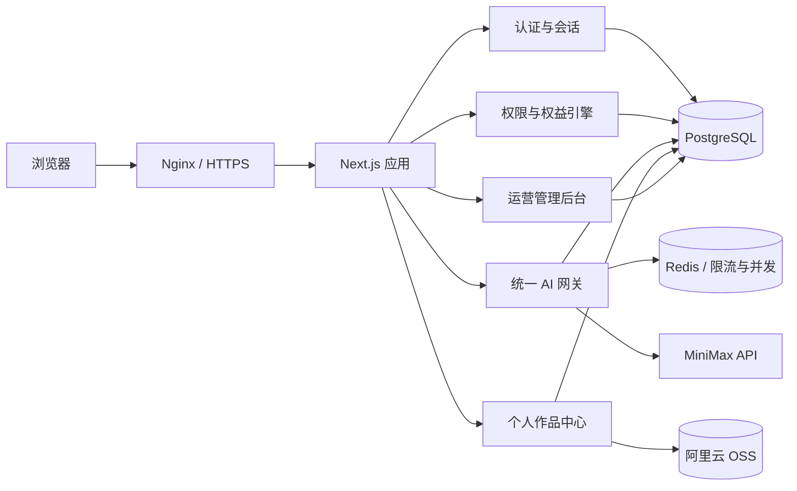

# 科瑞特 AI 平台用户分级与商业化规划

> 文档状态：`BASELINE / 长期主文档`  
> 版本：`v1.27`
> 最后更新：`2026-09-02`  
> 适用仓库：`https://github.com/ceason436-hue/AI-create`  
> 本地项目：`D:\programe\AI科瑞特\AI-create`  
> 当前生产域名：`lingpeak.com`  
> 当前生产服务器公网 IP：`47.111.227.165`

---

## 0. 文档定位与后续线程使用规则

本文件是科瑞特 AI 平台“用户身份、学校课堂、培训学员、社会用户、套餐、额度、作品存储、管理后台和 AI 成本控制”的单一长期规划基线。后续新线程开始实施相关功能前，必须先完整阅读本文件，再阅读实际代码；不能只根据聊天摘要直接改动。

### 0.1 代码仓库与阶段交付规则

- GitHub 地址：`https://github.com/ceason436-hue/AI-create`。该地址是本项目的正式 GitHub 代码仓库。
- 每个开发阶段或明确任务完成后，必须及时整理变更、提交 Git commit，并推送到上述 GitHub 远程仓库，确保远程仓库与阶段进度同步。
- 提交前应检查变更范围、运行与本阶段相关的必要验证，并在提交信息中清楚说明本阶段完成的内容；不得把多个已完成阶段长期滞留在本地未提交、未推送状态。

### 0.2 项目手册资料使用规则

- `长期记忆\AI科瑞特手册.pdf` 是项目提供的真实资料优先来源，制作主站、课程、校园合作、师资、成果和课程介绍页面时，应优先使用其中已经核验的文字与图片内容。
- 手册共 67 页，主要为视觉排版 PDF；当文字无法直接提取时，以页面视觉内容为准，并在后台内容或页面内部记录“来源：《AI科瑞特手册》”和待确认项。
- 手册中的真实图片可以直接作为资料展示或媒体库初始素材；若图片清晰度、裁切比例或网页格式不适合使用，可以生成同主题的概念图或使用明确标注的占位图，但不得把生成图冒充手册中的真实证书、教师、学校、课堂或获奖证明。
- 手册中的课程、专家顾问、奖项、证书、合作学校 Logo 等信息可先用于开发环境和后台草稿；正式公开前仍需由项目负责人确认展示授权、个人信息脱敏、证书细节和最终文案。
- 2026-09-02 实施记录：已将手册中核验的品牌介绍、徐鸿涛博士资料、课程体系与奖项页导出为正式应用开发素材，并在公开内容 fallback、后台草稿和长期规划中保留来源与待确认标记；正式发布前仍需完成授权核验。
- 2026-09-02 实施记录：AI 网关已接入匿名访客受控试用，首次使用提示登录或确认试用，按匿名设备、业务工具和自然日使用 Redis 计数，每个工具每日上限 5 次；匿名请求不写入个人账户、云端作品或课程学习数据。
- 2026-09-02 实施记录：匿名试用完成随机请求标识、脱敏匿名身份哈希、工具键、结果状态和时间的用量审计；仍不写入个人账户、云端作品或课程学习数据。
- 2026-09-02 实施记录：课件已增加私有对象存储驱动、后台受控上传、异步预览队列与失败重试；学员页面先获得五分钟预览会话令牌，再通过服务端代理读取预览件，并显示与登录标识关联的动态水印。生产部署仍需提供 OSS RAM、Worker 调度与 LibreOffice 转换环境。
- 2026-09-02 实施记录：课程内 AI 工具会在请求时携带课程和课时上下文，服务端对个人学员的有效报名、课时发布状态和工具绑定逐项校验；文本与编程模型仅接收已核验的课时标题与任务，不接受客户端自行伪造的课程提示词。运营后台新增课程模块、课时和工具绑定维护入口。
- 2026-09-02 实施记录：公开课程咨询和校园合作表单已接入后台线索列表，运营管理员可以筛选新建、跟进中、已处理与归档状态；联系方式只在受服务端角色校验的后台接口中读取，状态变更写入审计日志。
- 2026-09-02 实施记录：运营后台新增 `/admin/site-pages` 页面区块管理，可创建页面与区块、调整排序/主题/发布状态、编辑结构化内容载荷；每次保存或恢复均生成 `ContentRevision`，可选择历史版本恢复。首页的首屏、学习过程和咨询区块优先读取已发布 CMS 数据，数据库不可用时继续使用手册核验后的静态回退内容。活动、成果、师资、校区和合作内容的逐项版本恢复、真实媒体上传与授权管理仍在后续阶段。

后续维护规则：

1. 已标记为 `[已确认]` 的业务决策，不得在未征得项目负责人同意的情况下改变。
2. `[建议]` 表示已给出生产级推荐，但仍可在实施时细化。
3. `[待定]` 表示尚缺商业、供应商或运营输入，实施时必须再次确认。
4. `[暂不纳入]` 表示本版明确排除，不代表该事项已经解决或永远不需要。
5. 每次发生实质变更，必须同时更新“决策记录”“待确认事项”和文档版本号。
6. 不得把学校共享账号错误地实现成普通个人会员，也不得把学校课堂作品上传到个人作品库。
7. 不得只在前端隐藏按钮来实现权限；所有身份、套餐、额度和 AI 调用限制必须由服务端强制执行。

---

## 1. 项目结论摘要

科瑞特 AI 平台不应采用简单的“一级、二级、三级会员”模型。平台需要把以下三个概念分开：

- **身份来源**：学校共享账号、培训学员、社会注册用户、平台管理员。
- **管理角色**：平台超级管理员、运营管理员等。
- **使用权益**：学校课堂权益、培训免费权益、社会免费权益、标准会员、专业会员、加购点数。

这样可以支持同一个个人账户先通过培训邀请码获得免费权益，培训结束后继续作为社会用户购买套餐，而不必重新注册或迁移作品。

本规划的核心模式如下：

| 用户场景 | 登录方式 | 是否个人身份 | 作品保存 | 权益来源 |
|---|---|---:|---|---|
| 学校课堂 | 每校一个短共享账号 | 否 | 仅当堂、本机临时保存 | 学校合作权益 |
| 培训学员 | 个人用户名和密码；后续可加手机验证码 | 是 | 云端保存 | 邀请码绑定培训权益 |
| 社会免费用户 | 手机验证码注册（短信接入后开放） | 是 | 云端限量、限期保存 | 免费套餐 |
| 社会付费用户 | 个人账户登录 | 是 | 云端按套餐保存 | 会员套餐与点数包 |
| 平台管理员 | 独立管理员账号 | 是 | 不适用 | 后台角色权限 |

当前建议不是直接在现有按钮上增加几个弹窗，而是建设完整的“认证中心 + 权益中心 + AI 网关 + 作品中心 + 运营后台”。

---

## 2. 已确认业务决策

以下内容由项目负责人于 2026-08-31 确认：

### 2.1 学校合作场景

- `[已确认]` 不为学校里的每位学生创建账号。
- `[已确认]` 不采集学生姓名、手机号、身份证号等实名信息。
- `[已确认]` 每所学校使用一个简短共享账号，不使用连接符。
- `[已确认]` 不区分同一学校内的班级和学生身份。
- `[已确认]` 学校学生只需要完成当堂课内容。
- `[已确认]` 学校课堂生成内容不进入平台作品数据库。
- `[已确认]` 学生自行把需要保留的图片、音乐、代码等下载到机房电脑。
- `[已确认]` 学校教师不需要查看、下载或删除学生作品。
- `[已确认]` 暂不建设教师端“一键下发账号”。
- `[已确认]` 学校账号不向学生显示点数或配额，但平台后台必须具备并发保护、异常频率限制、成本预警和紧急暂停能力。

### 2.2 培训机构学员

- `[已确认]` 培训学员使用个人账户。
- `[已确认]` 初期可采用“用户名 + 密码 + 邀请码”。
- `[已确认]` 邀请码按课程、班级或活动发放，具备有效期、最大使用人数和权益期限。
- `[已确认]` 培训学员作品保存到云端。
- `[已确认]` 没有短信服务时由后台创建账号或使用用户名注册；短信接入后再增加手机号验证与找回密码。

### 2.3 社会用户和商业化

- `[已确认]` 社会用户自行注册。
- `[已确认]` 免费用户受到功能用量、云存储和保存周期限制。
- `[已确认]` 采用“会员包含月度点数，点数不足可以购买点数包”的组合模式。
- `[已确认]` 当前没有微信支付、支付宝商户号，初期由管理员人工开通套餐；商户能力准备完成后再接在线支付。
- `[已确认]` 社会个人账户的作品保存在云端。
- `[已确认]` 社会用户当前可使用“用户名 + 密码”自行注册，不以短信验证作为前置条件；手机号验证、密码找回和账号归属校验在短信服务接入后补充。
- `[已确认]` 社会用户注册与培训学员注册使用同一个注册窗口；培训邀请码为可选字段，填写后按培训权益注册，不填写则按社会免费用户注册。

### 2.4 云存储默认规则

- `[已确认]` 学校共享账号：不上传作品到平台作品库，仅保留当堂浏览器临时数据。
- `[已确认]` 培训学员：每人默认 2GB；培训权益结束后进入 180 天只读保留期。
- `[已确认]` 社会免费用户：默认 200MB；单个作品默认保留 30 天。
- `[已确认]` 社会付费用户：套餐分别提供 2GB 或 10GB。
- `[已确认]` 付费权益到期后进入 90 天只读期，之后按规则删除。
- `[已确认]` 个人用户可以下载和主动删除自己的作品。

### 2.5 当前资源与范围

- `[已确认]` 已有公司主体。
- `[已确认]` 域名 `lingpeak.com` 已完成 ICP 备案。
- `[已确认]` 当前没有短信服务、数据库和对象存储 OSS。
- `[已确认]` 预计合作学校约 10 所，每所 2–3 个班，每班约 30 人；课堂并发应按至少 30 人、建议按 60 人突发设计。
- `[已确认]` 主要学生年龄为二至六年级。
- `[暂不纳入]` 未成年人保护、隐私与内容合规的完整专项设计不在本版范围内；后续应另立专项，不得把“暂不纳入”解释为“已经合规”。

### 2.6 2026-08-31 已确认的基础设施与账号规则

- `[已确认]` 第一阶段在现有 ECS 使用 Docker 部署 PostgreSQL 16 与 Redis 7；数据库与 Redis 服务仅监听内网或本机，不直接暴露公网端口。
- `[已确认]` 后续生产可将 PostgreSQL 迁移至阿里云 RDS，应用仅通过 `DATABASE_URL` 连接；迁移采用备份恢复与短暂写入冻结，不改变业务数据模型。
- `[已确认]` OSS 暂未开通。开发阶段允许使用 `LOCAL` 存储驱动，但所有个人作品文件访问必须经过存储适配层，禁止在业务代码中绑定本地绝对路径。
- `[已确认]` 在正式开放培训学员或社会个人“云端作品”之前，必须开通私有 OSS Bucket；本地文件按对象键、校验和迁移到 OSS，数据库作品元数据和业务接口不重写。
- `[已确认]` 学校共享账号格式为 `KRT01`、`KRT02`……；初始密码为每校不同的 6 位数字，仅保存密码哈希。
- `[已确认]` 系统完成后将直接向学生开放。当前阶段学校学生使用共享账号，个人培训和社会账户总量预计不足 50 人，因此生产首发暂定阿里云 RDS PostgreSQL 16 基础系列（ARM 2 核 4GB、40GB ESSD PL0、杭州同 VPC）；ECS Docker 数据库仅限开发和迁移演练。
- `[已确认]` 上述基础系列是阶段性预算选择，不具备主备自动故障切换。个人账户、作品、订单或管理后台使用量明显增长，或学校课堂对中断容忍度降低时，必须评估升级至高可用系列；升级触发阈值在上线监控数据稳定后另行确认。
- `[已确认]` 生产首发建立华东 1（杭州）的私有 OSS Bucket，采用标准-同城冗余存储（ZRS）；初期按量付费，不预购 500GB 存储包，待连续一个月实际占用稳定后再按使用量购买匹配的资源包。
- `[已完成]` 生产 OSS Bucket 已创建：`krt-ai-works-hz-a7m2q9x4`，地域为华东 1（杭州），Endpoint 为 `oss-cn-hangzhou.aliyuncs.com`。已启用私有 ACL、阻止公共访问、标准 ZRS、版本控制、OSS 托管 AES256 加密；历史版本最后修改 30 天后删除。
- `[已确认]` 正式开放前将 ECS 公网带宽由 3Mbps 提升至至少 10Mbps，并在大文件迁至 OSS 签名 URL 后继续依据监控决定是否提升至 20Mbps 或接入 CDN。

### 2.7 2026-08-31 已确认的本地试运行与临时点数规则

- `[已确认]` 首个本地超级管理员登录标识为 `Eason_ADMIN`；管理员密码仅通过执行机器的临时环境变量提供，不写入仓库、文档或聊天记录。ECS 生产数据库独立，未来上线时需重新执行一次性初始化。
- `[已确认]` 试运行期的六类 AI 工具点数权重统一为 `0`，即不从个人钱包扣点；这不是匿名或无治理调用，所有请求仍必须经过服务端认证、账户状态与工具权益检查、Redis 限流、并发控制、幂等记录和不含作品内容的用量审计。
- `[已确认]` 本地验收完成后再部署 ECS；ECS 使用 Nginx 接管公网流量，应用 Compose 已调整为仅监听 `127.0.0.1:3000`。实际修改安全组和 Nginx 前仍须在服务器验证代理正常。

---

## 3. 当前项目审阅结果

### 3.1 审阅边界

本次已经审阅项目源码、页面、API 路由、配置、部署文档、测试输出、设计文档、资源清单、Git 状态和公开仓库结构。`node_modules`、`.next`、Git 对象、音频/图片二进制和压缩包内部重复文件按生成物或资源清单审阅，不逐字阅读第三方依赖源码。

项目主体位于：

`ai音乐/ai-music-app`

技术栈为：

- Next.js 16.2.4
- React 19.2.4
- TypeScript
- Tailwind CSS 4
- MiniMax 文本、图像、音乐和视觉接口
- Tone.js、Mammoth、html-to-image 等浏览器端库
- Docker + Nginx + 阿里云 ECS 部署说明

### 3.2 当前功能清单

| 模块 | 页面/接口 | 当前状态 |
|---|---|---|
| 官网首页 | `/` | 已有展示页；登录、注册按钮无功能 |
| AI 音乐课程 | `/ai-music`、`/stage1/*` | 节奏、音高、旋律、三键成曲等浏览器端互动 |
| AI 音乐生成 | `/ai-music/creation` | 调用 MiniMax；作品和收藏保存在 `localStorage` |
| AI 绘画 | `/ai-art` | 调用 MiniMax；作品保存在 `localStorage` |
| AI 编程 | `/ai-programming` | 调用 MiniMax 生成单文件 HTML；在带 sandbox 的 iframe 中预览 |
| AI 阅读 | `/ai-reading/*` | 文本分段、对话、绘图、视觉点评；历史保存在 `localStorage` |
| MiniMax 代理 | `/api/minimax/*` 共 6 条接口 | 服务端持有 API Key，但当前任何访问者均可匿名调用 |
| 用户系统 | 无 | 没有用户表、会话、密码、注册、找回密码或注销 |
| 权限与套餐 | 无 | 没有角色、权益、额度、订单、支付或计费账本 |
| 后台 | 无 | 没有学校、邀请码、用户、套餐、成本或审计后台 |
| 云端作品 | 无 | 没有数据库与对象存储 |

### 3.3 当前验证结果

- `[通过]` `npm.cmd run build`：生产构建成功，22 个页面/路由正常生成。
- `[未通过]` `npm.cmd run lint`：共 103 个问题，其中 63 个错误、40 个警告。
- `[事实]` 当前主要 lint 问题包括大量 `any`、未使用变量、React Hook 依赖、图片优化提示和少量代码风格问题。
- `[要求]` 用户分级实施前不强制一次性清零全部历史问题，但新增认证、计费和后台代码不得增加 lint 错误；正式上线前应建立可通过的 CI 基线。

### 3.4 当前关键风险

#### P0：公开压缩包可能包含旧密钥

公开 GitHub 仓库包含 `project.tar.gz`，本地检查该压缩包目录时发现其中包含 `.env.local`。无论密钥是否仍有效，都必须按可能泄露处理。

处理要求：

1. 立即轮换 MiniMax API Key。
2. 确认线上环境已切换到新密钥。
3. 从仓库当前版本和 Git 历史中移除含密钥压缩包。
4. 检查历史提交、构建日志和其他压缩包是否还有密钥。
5. 启用仓库密钥扫描；不得把 `.env*`、数据库备份或服务器配置打包提交。

#### P0：AI 接口完全匿名

当前所有 `/api/minimax/*` 路由没有登录验证、权限校验、额度校验或频率限制。任何人都可以绕过页面，直接调用接口消耗平台 API 余额。用户分级上线前必须先封住接口，而不是只隐藏页面按钮。

#### P1：个人作品只存在浏览器

现有 `localStorage` 无法跨电脑、跨浏览器或跨清理操作保留数据，不能满足培训学员和社会用户的云端作品需求。

#### P1：接口参数和成本缺少统一治理

当前各 MiniMax 路由独立处理请求，部分模型和工具参数可由客户端传入；没有统一请求大小限制、幂等处理、成本记账、并发队列和失败退款逻辑。

#### P1：生产基础设施未完整

当前已有 ECS、域名和备案，但没有数据库、Redis 类限流组件、OSS、短信服务和支付商户能力。域名在线状态在本次外部检查中超时，需在部署实施阶段从服务器、DNS、HTTPS 和 Nginx 四个层面重新验证。

---

## 4. 建设目标与非目标

### 4.1 一期目标

1. 登录、注册不再是前端空按钮。
2. 未登录用户不能直接调用任何付费 AI 接口。
3. 每所学校拥有一个易输入、可独立启停的共享账号。
4. 学校课堂数据仅在本机当堂保留，不形成学生云端档案。
5. 培训学员可通过邀请码获得有期限的免费权益，并跨设备访问云端作品。
6. 社会用户可注册、体验受限功能、购买会员或点数包。
7. 管理员可管理学校、培训班、邀请码、用户、套餐、订单、存储和 AI 成本。
8. 所有 AI 调用经过统一服务端鉴权、限流、记账和审计。
9. 作品存储、容量、到期和删除可自动执行。

### 4.2 本版非目标

- 不为学校课堂学生建立实名档案。
- 不建设学校教师后台和教师端账号下发软件。
- 不把学校课堂作品同步到云端作品库。
- 不在没有商户号时伪造在线支付。
- 不在没有短信供应商时伪造手机验证码。
- 不在本版展开未成年人保护与完整合规专项。
- 不在本规划中确定最终套餐价格和 MiniMax 成本换算值。

---

## 5. 总体产品模型

### 5.1 四层分离

平台采用四层模型：

1. **账户 Account**：谁在登录。
2. **角色 Role**：该账户能管理什么。
3. **权益 Entitlement**：该账户能使用哪些功能、有效到什么时候。
4. **用量 Usage/Credit**：每次 AI 调用和存储占用如何控制与记录。

账户类型建议：

```text
ADMIN                平台管理员
SCHOOL_SHARED        学校共享课堂账号
PERSONAL             培训学员或社会个人账号
```

个人账户的来源再单独记录：

```text
TRAINING_INVITE      通过培训邀请码加入
PUBLIC_SIGNUP        社会用户自行注册
ADMIN_CREATED        管理员创建
```

不要把 `TRAINING_STUDENT` 固化为不可改变的账户类型，否则培训结束后用户无法自然转为社会付费用户。

### 5.2 推荐架构



### 5.3 基础设施建议

生产推荐：

- 应用：保留现有阿里云 ECS 与 Docker 部署。
- 数据库：PostgreSQL；正式生产优先使用阿里云 RDS，预算受限时可先同机 Docker 部署，但必须异机备份。
- 限流与任务状态：Redis；正式生产优先使用阿里云 Redis。
- 文件：阿里云 OSS 私有 Bucket，通过短期签名 URL 访问。
- 反向代理：Nginx，强制 HTTPS，HTTP 301 跳转 HTTPS。
- 密钥：仅放生产环境变量或密钥管理服务，不进入镜像、仓库和压缩包。
- 环境：至少分为本地开发、测试/预发布、生产三套配置。

---

## 6. 学校共享课堂账号设计

### 6.1 账号格式

学校账号要求短、无连接符、适合二至六年级输入。

推荐规则：

```text
登录账号：KRT01、KRT02、KRT03……
初始密码：每校独立的 6 位数字
```

约束：

- 账号长度建议 5–8 位，只允许大写英文字母和数字。
- 字母前缀不混入 `O/I/L` 等易混淆字符；数字后缀固定为两位，并在账号卡上使用清晰字体区分数字 `0/1`。
- 每所学校密码为 6 位数字，且必须彼此不同。
- 密码只存储哈希，后台不能显示旧密码，只能重置新密码。
- 学校账号允许多设备并行登录，不采用“新登录踢出旧登录”。
- 学校终止合作、密码泄露或异常使用时，可以单独暂停该学校账号。

### 6.2 登录体验

登录页提供清晰入口：

- “学校课堂登录”
- “个人用户登录”
- “注册个人账号”

学校登录表单只保留两个字段：学校账号、密码。可以提供“显示密码”和大尺寸输入控件，不要求手机号、验证码、姓名或班级。

### 6.3 课堂临时工作区

学校共享账号进入 `CLASSROOM` 模式：

- AI 阅读、绘画、音乐作品历史使用 `sessionStorage` 或带短时过期的浏览器本地存储。
- 页面刷新后当堂历史仍可恢复；关闭课堂标签页或超过默认 12 小时后自动清理。
- 提供“下载作品”“下载代码”“保存图片/音乐”和“一键清空本堂记录”。
- 退出学校账号时默认提示是否清空本机课堂数据。
- 不向 `works`、`work_assets` 等云端作品表写入内容。
- 不向 OSS 上传学校作品。
- AI 请求仍会经过服务器和模型供应商完成生成，但平台业务数据库不保存提示词、文章正文、生成内容或作品文件。
- 允许保留不含作品内容的聚合用量记录，例如学校账号、工具类型、调用时间、成功/失败、估算成本。

### 6.4 学校成本保护

学校不看到点数，但平台内部必须有保护：

- 按工具设置并发上限和排队策略。
- 设置单日成本预警线和异常增长预警。
- 支持管理员单独暂停某学校、某工具或全平台 AI 生成。
- 课堂并发验收基线为 50 台设备同时使用；容量设计建议支持 100 台突发。

### 6.5 学校后台功能

管理员可执行：

- 新增、编辑、启用、暂停学校。
- 自动生成学校短账号。
- 重置学校密码。
- 设置合作开始/结束日期。
- 设置允许使用的工具。
- 查看聚合调用量、成功率和估算成本。
- 查看最近登录时间和异常告警。

管理员不得查看学校学生作品，因为平台不应保存这些作品。

---

## 7. 培训学员设计

### 7.1 初期注册流程

1. 学员进入“培训学员注册”。
2. 输入用户名、密码、确认密码和邀请码。
3. 服务端验证邀请码状态、有效期、最大使用人数和适用课程。
4. 创建个人账户并建立培训班成员关系。
5. 发放培训权益，记录开始时间、结束时间、可用工具和云存储上限。
6. 用户登录后进入个人作品中心。

用户名建议允许用户自定义，但必须全平台唯一；也可以由培训后台批量创建易输入账号。不得把邀请码本身当作密码。

### 7.2 邀请码规则

每个邀请码至少包含：

- 所属培训机构或班级
- 适用课程
- 状态：草稿、启用、暂停、过期、用尽
- 生效时间与失效时间
- 最大兑换人数
- 单个账户是否只能兑换一次
- 发放的权益模板
- 创建人和操作日志

邀请码使用后绑定个人账户。培训结束后，只结束培训权益，不删除个人账户和已有作品。

### 7.3 短信接入后的升级

后续采购短信服务后：

- 新用户可使用手机号验证码注册。
- 旧用户名账户可在个人中心绑定手机号。
- 手机号用于登录、找回密码和重要到期提醒。
- 一个手机号默认只能绑定一个主个人账户；确有家长代管多个孩子的需求时，需要单独设计家庭子账户，不能直接复用手机号唯一约束。

### 7.4 培训权益结束

- 权益到期后停止新增受限 AI 生成。
- 作品中心进入只读状态。
- 默认保留 180 天。
- 用户可以在保留期内下载作品、购买社会套餐继续使用，或主动删除数据。
- 若用户购买个人套餐，账户和作品无需迁移，只更新权益来源和存储上限。

---

## 8. 社会用户与套餐设计

### 8.1 注册开放条件

社会用户当前可使用用户名和密码完成自助注册；短信服务接入后增加手机号验证、找回密码和账号归属校验：

- 初期用户名必须全平台唯一，密码满足强度要求；当前不将手机号作为注册前置条件。
- 新注册账户自动获得 `FREE` 权益，默认 200MB 云存储，单件作品默认保留 30 天。
- 在短信验证上线前，暂不提供自助密码找回；正式付费账户开放范围和风险控制仍应由运营确认。

### 8.2 套餐结构

建议建立以下产品，而不是在代码中写死价格：

| 套餐 | 目标用户 | AI 权益 | 云存储 | 有效期 |
|---|---|---|---:|---|
| FREE | 新注册体验 | 少量月度点数 | 200MB | 长期；作品单件 30 天 |
| STANDARD | 日常学习与创作 | 中等月度点数 | 2GB | 月/季/年 |
| PRO | 高频创作 | 较高月度点数、较高并发 | 10GB | 月/季/年 |
| CREDIT_PACK | 点数不足用户 | 一次性点数 | 不单独增加或按产品配置 | 按规则有效 |

`[待定]` 套餐名称、价格、月度点数、点数包价格和是否自动续费，需要在取得 MiniMax 实际账单、短信费用、OSS 费用和支付通道费率后核定。

### 8.3 点数原则

- 点数是平台内部计量单位，不与 MiniMax Token 或人民币一一公开绑定。
- 文本、代码、视觉、绘图和音乐采用不同扣点权重。
- 权重由后台配置，不由前端写死。
- 请求开始前预占点数，成功后结算，明确失败时释放预占。
- 重试必须携带幂等键，防止重复扣点和重复生成。
- 套餐月度点数与加购点数分别记账，优先级和过期规则必须明确。
- 管理员人工赠送或补偿点数必须写入账本和审计日志。

### 8.4 付费过渡

阶段一没有支付商户号时：

1. 用户通过线下方式完成付款或由运营确认资格。
2. 管理员在后台创建“人工订单”。
3. 系统记录金额、套餐、开始/结束时间、经办人和备注。
4. 订单确认后由系统发放权益，不能直接改数据库余额。

阶段二取得微信支付/支付宝商户能力后：

- 服务端创建订单。
- 支付回调必须验签。
- 同一回调幂等处理。
- 以服务端支付成功通知为准，不能相信前端“支付成功”页面。
- 支持退款、关单、对账和异常订单处理。

---

## 9. 权限与功能矩阵

| 能力 | 未登录 | 学校共享 | 培训有效期内 | 社会免费 | STANDARD | PRO | 平台管理员 |
|---|---:|---:|---:|---:|---:|---:|---:|
| 浏览官网 | 是 | 是 | 是 | 是 | 是 | 是 | 是 |
| 使用浏览器端音乐练习 |  是| 是 | 是 | 是 | 是 | 是 | 是 |
| AI 文本/阅读 | 否 | 是，后台保护 | 是，按培训权益 | 少量点数 | 月度点数 | 较高点数 | 测试权限 |
| AI 绘画 | 否 | 是，后台保护 | 按培训权益 | 少量点数 | 是 | 是 | 测试权限 |
| AI 音乐生成 | 否 | 是，后台保护 | 按培训权益 | 可限制或试用 | 是 | 是 | 测试权限 |
| AI 编程 | 否 | 是，后台保护 | 按培训权益 | 少量点数 | 是 | 是 | 测试权限 |
| 云端作品 | 否 | 否 | 2GB | 200MB | 2GB | 10GB | 管理用途 |
| 购买套餐 | 否 | 否 | 是，可续为社会权益 | 是 | 是 | 是 | 后台管理 |
| 管理学校/用户 | 否 | 否 | 否 | 否 | 否 | 否 | 按后台角色 |

具体工具是否包含在某个培训班或套餐中，应由权益模板配置，不能散落在页面判断中。

---

## 10. 认证与会话设计

### 10.1 密码与会话

- 密码使用 Argon2id 或合适参数的 bcrypt 哈希，不可明文保存或可逆加密。
- 登录成功后使用服务端会话和 `HttpOnly + Secure + SameSite` Cookie。
- 不把长期 JWT 放入 `localStorage`。
- 学校共享账号允许多并发会话；个人账户可查看和退出其他设备。
- 管理员会话有效期更短，并记录敏感操作审计。
- 密码重置后可选择使旧会话全部失效。

### 10.2 账户状态

统一状态建议：

```text
PENDING      待激活
ACTIVE       正常
SUSPENDED    暂停
EXPIRED      合作或权益到期，不等于删除账户
LOCKED       风险锁定
DELETED      已进入删除流程
```

账户状态和权益状态必须分开。例如培训权益到期不应把个人账户标记为 `EXPIRED`，只结束相应 entitlement。

### 10.3 路由保护

- 页面层：根据账户类型和角色控制导航与入口。
- API 层：每条接口验证会话、账户状态和具体权限。
- AI 网关层：再次验证权益、用量、并发和请求大小。
- 管理后台层：按角色和操作粒度授权，不能只有一个前端 `isAdmin` 判断。

---

## 11. 个人作品中心与存储生命周期

### 11.1 作品模型

一个作品记录可表示：

- AI 图片
- AI 音乐
- AI 编程项目
- AI 阅读绘本
- 阅读视觉评分结果

数据库只保存作品元数据，实际大文件放 OSS。元数据包括所有者、类型、标题、创建时间、大小、状态、封面、到期时间和 OSS 对象键。

### 11.2 学校模式例外

学校共享账号调用生成接口时，服务端响应结果后不创建作品记录、不持久化文件到 OSS。若模型供应商返回临时 URL，应让浏览器及时下载或转换成可下载内容，并向学生提示链接可能过期。

### 11.3 生命周期状态

```text
ACTIVE        正常读写
READ_ONLY     权益到期，只能查看和下载
EXPIRING      即将删除
DELETING      删除任务执行中
DELETED       元数据和文件已删除
FAILED        上传或处理失败
```

### 11.4 容量与到期

- 上传/生成前检查剩余容量。
- 作品删除后异步回收 OSS 文件并核对容量账本。
- 培训学员权益结束：180 天只读保留。
- 社会付费到期：90 天只读保留。
- 社会免费作品：单件默认 30 天。
- 删除任务必须可重试，并防止数据库删除成功但 OSS 文件残留。
- 到期时间和容量规则由后台配置，并在个人作品中心明确展示。

### 11.5 现有本地数据迁移

个人用户第一次登录新版时，可检测现有 `localStorage`：

- 提示“发现本机旧作品，是否导入个人云端作品库”。
- 用户确认后逐项上传并受容量限制。
- 导入成功后由用户决定是否清除本机副本。
- 学校共享账号不出现云端导入提示。

---

## 12. 管理后台规划

### 12.1 后台角色

初期可以只开通 `SUPER_ADMIN`，数据库仍应支持后续拆分：

- `SUPER_ADMIN`：全部权限。
- `OPERATIONS_ADMIN`：学校、培训、用户、邀请码、套餐发放。
- `FINANCE_ADMIN`：订单、退款、对账和人工开通。
- `SUPPORT_ADMIN`：账号状态、密码重置、问题排查，不能改财务数据。

### 12.2 后台模块

#### 总览

- 今日/本月活跃账户
- 各类用户数量
- AI 调用次数、成功率和估算成本
- 高成本工具趋势
- 失败率、超时、限流和异常账号告警
- OSS 使用量与即将到期作品量

#### 学校管理

- 学校名称、代码、联系人备注、合作期限
- 生成短共享账号、重置密码、启停账号
- 配置可用工具和后台保护参数
- 查看聚合用量与成本，不查看作品内容

#### 培训管理

- 培训班/课程
- 邀请码生成、暂停、作废和兑换记录
- 学员列表、权益起止时间
- 批量创建或导入用户名账户
- 培训结束与延期

#### 用户管理

- 搜索个人账户
- 查看账户来源、状态、角色和权益
- 重置密码、暂停账户、结束会话
- 人工发放权益或点数
- 查看作品容量和到期状态

#### 套餐、点数和订单

- 套餐版本化配置
- 工具扣点权重
- 月度点数发放
- 点数账本查询
- 人工订单、在线订单、退款和对账

#### AI 与成本控制

- 各工具启停开关
- 模型版本和供应商配置
- 请求大小、频率、并发和超时设置
- 单日成本预警
- 全局紧急停止开关

#### 存储与清理

- 套餐容量规则
- 即将到期作品
- 删除任务、失败重试和 OSS 孤儿文件核对

#### 审计与安全

- 管理员登录和敏感操作日志
- 学校账号异常登录
- 邀请码滥用
- 订单和点数人工调整记录

---

## 13. 推荐数据模型

以下为逻辑数据模型，实施时可使用 Prisma 或其他 PostgreSQL ORM 生成迁移。

| 表 | 主要用途 | 关键字段示例 |
|---|---|---|
| `accounts` | 所有可登录主体 | id、type、login_identifier、password_hash、status |
| `personal_profiles` | 个人账户资料 | account_id、display_name、mobile、mobile_verified_at |
| `organizations` | 学校或培训机构 | id、type、name、code、status |
| `organization_accounts` | 学校共享账号或机构关联 | organization_id、account_id、valid_from、valid_to |
| `cohorts` | 培训班/课程 | organization_id、name、start_at、end_at |
| `cohort_members` | 个人学员归属 | cohort_id、account_id、joined_at、status |
| `invitation_codes` | 培训邀请码 | code_hash、cohort_id、max_uses、used_count、expires_at |
| `roles` / `account_roles` | 后台角色 | role_key、account_id |
| `plans` | 套餐模板与版本 | code、version、storage_limit、status |
| `entitlements` | 账户实际权益 | account_id、source、plan_id、starts_at、ends_at |
| `credit_wallets` | 当前点数汇总 | account_id、balance、reserved_balance |
| `credit_ledger` | 不可变点数账本 | delta、reason、reference_type、reference_id |
| `works` | 个人作品元数据 | owner_id、type、title、status、size_bytes、expires_at |
| `work_assets` | OSS 文件元数据 | work_id、object_key、mime_type、size_bytes、checksum |
| `orders` | 人工/在线订单 | account_id、channel、amount、status、idempotency_key |
| `payments` | 支付回调和退款 | order_id、provider_trade_no、status、raw_event_ref |
| `usage_events` | AI 用量和成本 | account_id、tool、status、units、estimated_cost |
| `ai_requests` | 生成请求生命周期 | request_id、idempotency_key、reserved_credits、status |
| `sessions` | 服务端会话 | account_id、expires_at、revoked_at、device_summary |
| `audit_logs` | 管理员与敏感操作 | actor_id、action、target_type、target_id、result |
| `system_settings` | 可运营配置 | key、value、version、updated_by |
| `retention_jobs` | 到期清理任务 | work_id、scheduled_at、status、attempts |

约束要求：

- 学校共享账号也放在 `accounts`，但 `type=SCHOOL_SHARED`，不创建个人资料。
- 邀请码数据库中建议存哈希或受控值，后台只在生成时展示完整码。
- 点数账本采用追加记录，不直接覆盖历史。
- 订单、支付回调、AI 请求均使用幂等键。
- 所有时间统一以 UTC 入库，界面按中国时区显示。

---

## 14. API 与服务端改造

### 14.1 新增接口域

```text
/api/auth/*                 登录、注册、退出、会话、密码重置
/api/invitations/*          邀请码验证与兑换
/api/me/*                   个人资料、权益、点数、存储状态
/api/works/*                个人作品和上传签名
/api/ai/*                   统一 AI 生成入口
/api/orders/*               套餐订单
/api/payments/*             后续支付回调
/api/admin/*                管理后台
```

现有 `/api/minimax/*` 不应继续作为可被浏览器任意调用的裸代理。可以迁入内部服务，或至少统一经过相同的认证、权益和成本中间层。

### 14.2 AI 请求标准流程

1. 验证会话和账户状态。
2. 识别学校共享或个人账户模式。
3. 校验工具访问权限。
4. 校验请求结构、文本长度、文件类型和文件大小。
5. 执行频率、并发和全局熔断检查。
6. 个人账户预占点数；学校账号写入内部成本保护状态。
7. 使用服务端固定模型白名单调用 MiniMax。
8. 成功后结算点数和用量；失败则释放预占。
9. 个人账户按选择保存云端作品；学校账号只返回结果，不持久化作品。
10. 返回统一的请求 ID，便于排错和防止重复提交。

### 14.3 必须修正的现有接口问题

- 客户端不得任意指定模型或 `tools`。
- 所有输入使用运行时 Schema 校验。
- 限制文本长度、图片 Base64 大小和上传 MIME 类型。
- API 错误不能把供应商原始敏感响应直接返回给用户。
- 生产日志默认不记录提示词全文、文章全文、图片 Base64 或 API Key。
- 为长任务设计任务状态或队列，避免单纯依赖 120 秒 HTTP 请求。
- 音乐、图片等重复点击使用幂等键。
- 统一供应商超时、重试和熔断策略。

---

## 15. 安全、稳定性与运维基线

### 15.1 安全基线

- 轮换并安全保存 MiniMax API Key。
- 所有 AI 接口默认拒绝匿名请求。
- 登录、注册、邀请码验证、AI 生成分别设置限流。
- 管理后台和普通前台使用独立权限检查。
- 生成 HTML 继续使用无 `allow-same-origin` 的 sandbox iframe，并配置 CSP。
- 对上传文件检查类型、大小和扩展名，不信任浏览器声明。
- OSS Bucket 设为私有，不使用永久公网 URL。
- 敏感配置不得写入 Git、Docker 镜像、日志和前端 Bundle。
- 管理员的重要变更记录前后值、操作者和时间。

### 15.2 监控指标

- 登录成功率和失败率
- AI 各工具请求量、延迟、失败率和估算成本
- 学校课堂并发与排队时间
- 点数预占未结算数量
- 数据库连接、Redis、磁盘、CPU 和内存
- OSS 使用量、上传失败、清理失败
- 订单支付状态不一致数量
- 5xx、超时和 Nginx 504

### 15.3 备份与恢复

- PostgreSQL 每日自动备份，定期做恢复演练。
- OSS 使用生命周期和版本策略，避免误删后无法恢复。
- 数据库备份不得放在同一台 ECS 的唯一磁盘上。
- 记录 RPO/RTO 目标；上线初期建议至少做到每日备份、可恢复验证。

---

## 16. 实施阶段与依赖关系

以下工期以一名熟悉现有代码的全栈开发者为粗略估算，不包含商户号、短信签名审核等外部等待时间。

### Phase 0：安全止血与基线整理（1–3 天）

- 统一环境变量样例。
- 建立可接受的 lint/CI 基线。

### Phase 1：数据与认证底座（5–8 个工作日）

- 建立 PostgreSQL、Redis 和 OSS 测试环境。
- 完成账户、密码哈希、会话和账户状态。
- 建立角色权限框架。
- 完成登录页三入口和退出登录。
- 所有现有 AI 接口接入鉴权中间层。

**完成标准：** 不同账户类型可正确登录，未登录访问 AI API 返回 401。

### Phase 2：学校课堂模式与学校后台（4–6 个工作日）

- 学校和短共享账号管理。
- `CLASSROOM` 模式和当堂临时存储。
- 下载、清空、退出提示。
- 学校账号并发、频率、成本告警和紧急暂停。
- 30/60 台设备课堂并发测试。

**完成标准：** 学校可正常上课，作品数据库和 OSS 中没有学校课堂作品。

### Phase 3：培训学员、邀请码与云端作品（7–10 个工作日）

- 用户名/密码/邀请码注册。
- 培训班、邀请码和权益期限后台。
- 个人作品中心、OSS 上传、容量和生命周期。
- 现有 `localStorage` 个人作品导入。
- 培训到期 180 天只读逻辑。

**完成标准：** 学员跨设备登录可看到作品，邀请码人数和有效期不可绕过。

### Phase 4：社会用户、点数和人工套餐（7–10 个工作日）

- FREE、STANDARD、PRO、CREDIT_PACK 模型。
- 点数预占、结算、退款和账本。
- 免费作品 30 天、付费到期 90 天只读。
- 人工订单与后台开通套餐。
- 用户端套餐、点数和存储状态页面。

**完成标准：** 免费用户无法超额调用，人工开通可追溯且不会直接篡改余额。

### Phase 5：短信与在线支付（外部资质就绪后，7–12 个工作日）

- 短信注册、绑定、登录与找回密码。
- 微信支付/支付宝下单、回调、幂等、退款和对账。
- 异常订单后台。

**完成标准：** 支付回调重复发送不会重复发放权益，退款和对账有完整记录。

### Phase 6：上线加固（5–8 个工作日）

- 安全测试、压力测试、恢复演练。
- 全链路监控和成本看板。
- 正式域名 HTTPS、Nginx、备份和发布回滚。
- 修复阻断上线的 lint、类型和稳定性问题。

**整体粗估：** 不含外部审核等待，约 6–10 人周。若由一人兼职开发，日历时间会更长。

---

## 17. 需求编号与实施追踪

| 编号 | 需求 | 优先级 | 阶段 |
|---|---|---:|---|
|  |
| SEC-02 | 禁止匿名调用 AI 接口 | P0 | Phase 0–1 |
| AUTH-01 | 服务端会话登录与退出 | P0 | Phase 1 |
| AUTH-02 | 账户状态和密码重置 | P1 | Phase 1 |
| SCH-01 | 每校短共享账号 | P0 | Phase 2 |
| SCH-02 | 学校课堂临时存储模式 | P0 | Phase 2 |
| SCH-03 | 学校成本保护与紧急暂停 | P0 | Phase 2 |
| TRN-01 | 用户名、密码、邀请码注册 | P0 | Phase 3 |
| TRN-02 | 培训班和权益期限 | P0 | Phase 3 |
| WRK-01 | 个人云端作品中心 | P0 | Phase 3 |
| WRK-02 | 容量、到期和自动清理 | P1 | Phase 3–4 |
| ENT-01 | 权益模板和功能权限 | P0 | Phase 3–4 |
| CRD-01 | 点数钱包和不可变账本 | P0 | Phase 4 |
| ORD-01 | 人工订单和套餐开通 | P1 | Phase 4 |
| SMS-01 | 手机验证码和找回密码 | P1 | Phase 5 |
| PAY-01 | 在线支付、退款与对账 | P1 | Phase 5 |
| ADM-01 | 统一运营后台 | P0 | Phase 2–5 |
| OPS-01 | 监控、告警、备份与恢复 | P0 | Phase 0–6 |

---

## 18. 测试与验收标准

### 18.1 身份与权限

- 登录、注册按钮具备真实流程。
- 未登录直接请求所有 AI API 均被拒绝。
- 学校账号不能访问个人作品中心、订单或个人资料。
- 普通个人用户不能访问管理后台。
- 被暂停学校账号的新旧会话均不能继续生成。

### 18.2 学校课堂

- 每所学校账号可以独立启停和重置密码。
- 30 台设备同时登录不会互相踢下线。
- 60 台设备突发请求时系统可排队或明确提示，不出现无限并发。
- 刷新页面仍能看到当堂历史；关闭课堂会话或超过期限后按规则清理。
- 学校作品不进入 PostgreSQL 作品表和 OSS。
- 图片、音乐、代码可以下载到本机。

### 18.3 培训与个人账户

- 过期、暂停、人数用尽的邀请码不能兑换。
- 同一账户不能重复领取同一邀请码权益。
- 换电脑登录可以看到云端作品。
- 超过 2GB 后不能新增云端作品，但已有作品可以下载。
- 培训到期后进入 180 天只读期，购买个人套餐后可继续使用原账户。

### 18.4 点数与订单

- 余额不足时请求在调用供应商前被拒绝。
- 明确失败的生成请求释放预占点数。
- 相同幂等键不会重复扣点或重复发放套餐。
- 人工订单记录经办人和依据。
- 支付回调重复、乱序或伪造时不会重复发放权益。

### 18.5 存储与清理

- 免费作品到期、付费只读期和培训保留期按配置执行。
- 删除数据库记录与 OSS 文件一致。
- 清理失败可以重试并产生告警。
- 容量账本与 OSS 实际文件大小可以核对。

### 18.6 工程质量

- 生产构建通过。
- 新增代码无新增 lint 错误。
- 核心认证、权益、点数和订单逻辑有单元测试。
- 登录、学校课堂、邀请码、作品、套餐至少有端到端测试。
- 数据库迁移可在测试环境从零执行并可回滚或前向修复。

---

## 19. 上线与回滚策略

1. 先上线数据库和新接口，但通过功能开关隐藏新入口。
2. 先让内部管理员和一所测试学校验证共享账号。
3. 再迁移培训学员和个人作品。
4. 最后开放社会注册和套餐。
5. 在线支付单独灰度，不和用户系统首发绑定。
6. 每个阶段保留旧页面的短期回滚开关，但旧匿名 AI API 不得重新开放。
7. 发布前备份数据库；发布后观察错误率、AI 成本和登录成功率。

---

## 20. 待确认事项

以下事项不阻塞本规划成立，但在对应阶段开始前必须确认：

1. `[待定]` 各学校允许使用的 AI 工具是否完全相同。
2. `[待定]` MiniMax 实际结算成本及各工具点数权重。
3. `[待定]` STANDARD、PRO 和点数包的最终价格。
4. `[待定]` 短信供应商、签名、模板和费用。
5. `[待定]` 微信支付、支付宝商户号申请时间和首发渠道。
6. `[待定]` 阿里云 RDS 迁移窗口与规格；在首次生产个人账户数据写入前确认。
7. `[待定]` OSS Bucket、CDN 和容量预算；在首次生产个人作品上传前确认。
8. `[待定]` 社会用户正式开放时间和预计规模。
9. `[待定]` 未成年人保护、隐私和内容安全专项的启动时间。
10. `[待定]` 首个 `SUPER_ADMIN` 的登录标识和安全初始化执行窗口；确认后才可设置 `KRT_BOOTSTRAP_ADMIN_*` 环境变量并执行初始化脚本。
11. `[待定]` 各 AI 工具的实际点数权重；部署后由 `SUPER_ADMIN` 通过 `/api/admin/ai-settings` 配置。未配置时个人 AI 请求必须保持拒绝，不能以代码默认值绕过成本控制。

---

## 21. 决策记录

| 日期 | 决策 | 原因/影响 |
|---|---|---|
| 2026-08-31 | 学校不用学生个人账号，改为每校一个短共享账号 | 适合二至六年级机房课堂，减少分发和登录复杂度 |
| 2026-08-31 | 学校作品仅当堂本机临时保存 | 学校只需要完成课堂内容，不需要教师查看或平台归档 |
| 2026-08-31 | 学校账号不显示点数，但接受后台成本保护 | 保持课堂体验，同时避免密码泄露或批量调用造成成本失控 |
| 2026-08-31 | 培训学员采用个人账号和邀请码权益 | 支持跨设备作品、课程期限和后续转社会付费用户 |
| 2026-08-31 | 社会付费采用会员月度点数 + 点数包 | 同时控制 AI 成本并支持高频用户追加使用 |
| 2026-08-31 | 无短信和商户号时采用分阶段过渡 | 不伪造验证码或支付能力，先支持后台创建和人工开通 |
| 2026-08-31 | 未成年人保护与完整合规专项暂不纳入本版 | 项目负责人明确要求本阶段排除，后续另行规划 |
| 2026-08-31 | 规划文档作为例外保存到项目 `长期记忆` 目录 | 便于 GitHub 和后续开发线程持续读取 |
| 2026-08-31 | 第一阶段在 ECS Docker 部署 PostgreSQL 16 与 Redis 7 | 快速建立认证、权益、限流与任务状态底座；后续可通过连接串和备份恢复迁往 RDS |
| 2026-08-31 | OSS 未开通前使用可替换的本地存储驱动 | 开发不中断；正式开放个人云端作品前必须迁至私有 OSS |
| 2026-08-31 | 学校账号使用 KRT 前缀和每校独立 6 位数字密码 | 适合小学生输入；密码只保存哈希 |
| 2026-09-02 | 系统首发将直接面向学生，OSS 选私有 ZRS | 学生作品需要跨可用区存储保障；开发环境仍保留本地存储适配层 |
| 2026-09-02 | 当前 RDS 暂定 PostgreSQL 16 基础系列、ARM 2C4G、40GB ESSD PL0 | 学校使用共享账号，个人账户不足 50 人；以预算优先，后续按监控结果评估升高可用 |
| 2026-09-02 | 杭州私有 ZRS Bucket 已创建并启用版本控制与托管加密 | 作为个人作品对象存储；访问必须由服务端签发短期链接，初期按量付费 |
| 2026-08-31 | AI 网关先以 Redis 可用为前提，限流组件不可用时拒绝 AI 调用 | 防止 Redis 故障时退化为匿名或无限并发调用，优先控制成本风险 |
| 2026-08-31 | 首个超级管理员采用仅限环境变量的一次性初始化脚本 | 避免在代码、迁移或示例配置中固化管理员账号和密码；创建后拒绝再次引导初始化 |
| 2026-08-31 | 社会用户先开放用户名密码自助注册，短信能力后续补充 | 先支持个人账户试运行；注册时自动发放免费权益，手机号验证和找回密码作为后续安全升级 |
| 2026-08-31 | 社会用户与培训学员合并为同一注册窗口，邀请码改为可选字段 | 降低入口复杂度；服务端仍根据是否填写邀请码分别执行免费注册或培训权益兑换 |
| 2026-08-31 | 运营后台改为独立全屏页面，不继承主站背景与应用导航 | 后台属于运营工作空间，使用左侧主导航、顶部子标签，并提供返回主站入口 |
| 2026-08-31 | 运营后台桌面端左侧导航固定在视口内 | 右侧工作区独立滚动，长页面操作时保持导航可见；移动端保留顶部横向导航 |
| 2026-08-31 | 后台顶部子标签必须切换独立工作内容 | 学校账号与课堂配置、培训班与邀请码分别展示各自的创建、列表或配置操作，避免单页堆叠造成误解 |
| 2026-09-02 | 社会用户和培训学员注册/登录成功后默认返回主站首页 | 登录后的默认入口保持产品总览，不强制进入某个具体创作工具 |
| 2026-09-02 | 学校密码重置支持管理员自定义六位数字且不限制重置次数 | 便于学校密码交付和泄露后的快速轮换，密码仍只保存哈希 |
| 2026-09-02 | 后台支持删除学校、培训机构、培训班和邀请码 | 删除操作由服务端鉴权、事务和审计保护；删除培训机构不删除已注册个人账户 |
| 2026-09-02 | 后台危险操作改用页面内弹窗，学校与培训管理改为双栏工作区 | 降低误操作风险并提升数据管理效率；创建结果即时反映在列表和邀请码选择器中 |
| 2026-09-02 | 个人作品页采用圆角卡片式工作区 | 提升作品浏览、存储状态查看和下载删除操作的可读性 |

---

## 22. 下一步推荐执行顺序

下一线程不要直接从登录页面开写，推荐严格按以下顺序推进：

1. 已确定第一阶段使用 ECS Docker PostgreSQL/Redis、本地存储适配层及 KRT 账号规则。
2. 已输出 Prisma 数据模型、Docker 基础设施配置与环境变量模板。
3. 继续完成认证、会话、权限与首次安全管理员初始化。
4. 实现所有 AI API 的统一鉴权、限流、幂等和成本保护。
5. 实现每校短共享账号和课堂临时模式。
6. 实现培训邀请码、个人作品和社会套餐；在生产个人作品开放前确认 OSS 配置。

---

## 23. 当前开发进度（2026-08-31）

已完成且已在本地工程中验证：

- 新增 `docker-compose.infrastructure.yml`：PostgreSQL 16、Redis 7，端口仅绑定 `127.0.0.1`。
- 新增 `.env.platform.example` 与 `.env.infrastructure.example`：明确数据库、Redis、会话、AI 网关、本地/OSS 存储配置。
- 新增 `prisma/schema.prisma`：覆盖账户、角色、学校、培训班、邀请码、套餐权益、点数账本、作品元数据、订单、AI 请求、会话、审计和保留期任务。
- 已通过 `prisma validate` 与 `prisma generate`；新增基础认证接口：`/api/auth/login`、`/api/auth/logout`、`/api/auth/session`。
- 认证会话现已加载账户角色；新增 `requireRole` 权限框架，并提供只接受显式环境变量确认、最少 12 位密码且仅能执行一次的 `SUPER_ADMIN` 初始化脚本。
- 六个 `/api/minimax/*` 接口已接入统一 AI 网关：未登录请求拒绝、账户状态/角色/学校或个人工具权益校验、Redis 限流和并发保护、请求大小限制、幂等请求记录及不含作品内容的用量审计已启用。模型和联网工具由服务端白名单控制，供应商原始错误不再传给浏览器。
- 已新增 `/login` 学校课堂/个人账户登录页面，首页和应用导航的登录入口改为真实链接；已新增超级管理员保护的 `/api/admin/schools`、`/api/admin/schools/[schoolId]` 与密码重置接口。学校账号按 `KRT01`、`KRT02` 顺序生成，初始/重置密码使用加密随机六位数字，仅在响应中展示一次，数据库只保存哈希；学校默认不启用任何 AI 工具，必须由管理员显式配置。
- 已新增培训学员邀请码注册 `/register/training` 与 `/api/auth/register/training`，并新增管理员培训班、权益模板和邀请码接口：`/api/admin/training/cohorts`、`/api/admin/plans`、`/api/admin/invitations`。邀请码明文只在创建响应中返回，兑换在串行化事务内完成账户、班级成员、权益、使用次数和审计记录；登录与培训注册均要求 Redis 限流组件可用。
- 已新增可替换的 `LOCAL` 存储适配器和个人作品 API `/api/works`、`/api/works/[workId]`、`/api/works/[workId]/download`。个人账户按当前权益模板校验存储容量并可上传、查看、下载、删除作品；学校共享账号、无存储权益账户和超容量请求均由服务端拒绝，业务代码不绑定本地绝对路径。`npm run works:retention` 会处理到期的本地作品，并在非 LOCAL 驱动下拒绝运行，直至 OSS 驱动完成。
- 已新增 `/api/me/status` 和个人“我的作品”页面 `/my-works`，展示个人账户的云端容量、列出作品并提供受服务端认证的下载和删除操作；学校课堂账号不显示该入口且无法取得个人作品数据。
- “我的作品”页面可发现本浏览器 `ai_art_works` 中实际保存的 Base64 旧绘画，用户逐项确认后才导入个人作品库；外部临时 URL、音乐历史、阅读历史和学校课堂数据均不会自动上传。
- AI 绘画生成成功后，个人账户会异步保存可识别的 Base64 图片到云端作品库；学校课堂账号的持久化请求由服务端拒绝且不影响当堂生成和本机临时历史。
- AI 编程生成成功后，个人账户会异步保存生成的单文件 HTML 到云端作品库；学校课堂账号仍仅保留本机临时数据，不进入作品表或存储驱动。
- 已新增受管理员会话保护的运营后台 `/admin`：可在既有受审计 API 上创建学校课堂账号、培训班、权益模板和邀请码；可编辑学校启停、课堂工具和合作期限，并可重置学校密码。账号密码与邀请码明文均只在成功后的当前提示中出现一次，页面不预填或自动提交任何商业参数。
- 已新增 `/api/admin/ai-settings` 点数权重配置接口。个人 AI 请求会在供应商调用前原子预占点数，成功时写入不可变账本并结算，失败时释放预占；尚未配置权重时个人请求安全拒绝，不使用硬编码成本值。
- 已新增 `/api/admin/orders` 人工订单接口。管理员必须显式提供个人账户、权益模板、金额、起止时间、备注和幂等键；订单、权益、点数发放及审计日志在同一串行化事务中完成，代码不伪造在线支付能力。
- 已由 Prisma 从现有数据模型生成零起点初始迁移 `prisma/migrations/20260831170000_initial_platform/migration.sql`，并核验迁移 SQL 保留注释和语句边界；部署前仍需在隔离 PostgreSQL 环境执行 `prisma migrate deploy` 验证。
- 学校共享账号的服务端会话和课堂模式 Cookie 均为 12 小时；个人会话为 30 天，管理员会话为 8 小时。新增 `npm run ai:recover` 仅回收超过可配置阈值的 `RUNNING` AI 请求并返还其预占点数，生产部署后须由受控的主机定时任务调度。
- 新增 `npm test`（Vitest）基线：已覆盖管理员、学校共享、个人账户的会话时长，以及 AI 点数表必须完整且每项为非负整数的校验。认证和网关相关改动应至少保持这些测试、TypeScript 和生产构建通过。
- 审计发现本地诊断脚本中存在明文 MiniMax 凭据，已改为只读取 `MINIMAX_API_KEY` 环境变量；当前源码扫描未发现 `sk-api-` 格式的硬编码凭据。该凭据仍须由项目负责人在 MiniMax 控制台轮换，并在部署前重新核查仓库历史、构建日志及其他归档文件。
- 已审阅历史 ECS 部署指南和应用 Compose：数据库/Redis 专用基础设施 Compose 已正确绑定本机，但历史应用 Compose 与文档仍公开映射 `3000`。平台正式上线前必须确认 Nginx 已接管流量，再将应用端口改为仅本机可访问；本轮仅更新了部署前置说明，未触碰现有线上访问配置。
- 新增 `npm run security:scan`：扫描源码和配置文本中的常见明文 MiniMax/OSS 凭据模式，排除 `.env`、Git、依赖和构建产物，命中时只报告文件与规则名；Vitest 已显式排除 `.next`，避免构建产物重复计入测试结果。
- 已在本机完成一次实际部署验证：Docker Desktop 恢复后，PostgreSQL 16 与 Redis 7 容器均健康运行且仅绑定本机；Prisma 初始迁移已成功应用到本地 `krt_ai` 数据库。Windows 将 `5432` 划入保留端口范围，本地使用可配置的 `POSTGRES_HOST_PORT=5540`，ECS 默认仍为 `5432`。
- 本地 `SUPER_ADMIN` 已通过一次性脚本成功初始化，六类 AI 工具已通过受保护管理员 API 配置为 `0` 点扣费。运行时已验证匿名 AI 请求返回 `401`、管理员可读取配置、已登录无效 AI 请求返回 `400` 而不调用供应商。
- 初始化脚本已兼容 Node 24 的 `bcryptjs` CommonJS 导入；新增 `npm run admin:reset-password`，需显式确认变量才可重设超级管理员密码、撤销其现有会话并写入审计。任何通过聊天或其他不受保护渠道出现过的管理员密码都必须在上线前重置。
- 社会用户已新增 `/register` 用户名密码自助注册：服务端按限流、密码强度、用户名唯一性和串行化事务创建个人账户、默认 `FREE` 权益、点数钱包及审计记录；首次注册会创建可由后台版本化管理的 `FREE` 模板（200MB、全部试运行 AI 工具），免费用户作品默认最多保留 30 天。短信验证、密码找回和手机号绑定仍待后续阶段实现。
- 管理后台 `/admin` 已重构为标准管理后台布局：左侧主导航、顶部子标签、工作台概览、圆角边框和分区工作区；原有学校、培训班、邀请码、权益模板和 AI 点数操作保持可用。
- `/register` 现为社会用户与培训学员共用注册窗口；邀请码可选，填写后调用培训兑换流程，不填写则调用社会免费注册流程。旧 `/register/training` 地址保留并自动跳转到统一注册窗口。
- 运营后台已移入独立 `(admin)` 路由组，`/admin` 不再嵌套主站背景、顶部导航或应用内容边距；页面提供独立左侧导航、顶部标签栏和“返回主站”按钮。
- 运营后台左侧导航已设置桌面端视口固定高度和粘性定位，右侧内容滚动时导航保持可见；移动端自动恢复顶部导航布局。
- 运营后台的“学校账号 / 课堂配置”和“培训班 / 邀请码”已拆分为独立内容区；刷新时采用可用数据优先策略，单个统计接口暂时失败不会清空已成功加载的学校、培训或邀请码列表。
- 已修复后台提交后调用已失效表单引用导致的 `reset` 异常；创建学校、培训班后会正常刷新并保留列表数据。
- 学校密码重置接口现要求管理员提交自定义六位数字密码，重置次数不设上限，旧会话会全部撤销；后台学校账号列表新增删除学校按钮。
- 新增受管理员鉴权和审计保护的删除接口：删除学校、培训班、培训机构和邀请码；删除培训机构会级联删除其培训班及邀请码，但保留已经注册的个人账户。
- 普通个人注册和培训邀请码注册、个人登录成功后默认跳转主站首页 `/`。
- 运营后台删除学校、培训机构、培训班和邀请码使用页面内确认弹窗；学校密码重置使用页面内六位数字密码弹窗。
- 后台学校账号、培训班、邀请码页面采用创建表单与数据列表左右双栏布局，创建成功后立即同步列表，邀请码下拉框可选择新建培训班。
- “我的作品”页面升级为圆角工作区布局，提供存储概览、作品状态、响应式作品卡片和空状态引导；原有下载、删除和本机旧绘画导入接口保持不变。
- 修复邀请码列表接口未返回培训机构关系导致后台刷新白屏的问题；创建邀请码后前端即时写入列表，并对缺失机构数据增加容错。
- 后台批量加载接口增加非 JSON 响应容错和失败兜底状态，避免单个接口异常时页面停留在空白加载状态。
- 修复邀请码后台接口直接序列化权益模板 `BigInt` 导致 HTTP 500、进而被误报为权限不足的问题；接口现将存储容量转换为字符串。
- 权益模板创建成功后立即同步到后台状态，邀请码生成表单可即时选择新建模板。

未完成或需后续确认：

- 首个 `SUPER_ADMIN` 的安全初始化方法已就绪；账号标识和实际初始化时机仍必须由项目负责人确认后才执行。
- MiniMax 凭据轮换和线上环境切换待项目负责人确认；旧凭据按可能已泄露处理，不能因本地脚本已清理而继续使用。
- 是否确认由 Nginx 统一公网入口，并将应用 Compose 从 `3000:3000` 收紧为 `127.0.0.1:3000:3000`；该项会影响当前线上访问，须先确认。
- 本地管理员初始密码曾经由非受保护渠道提供，必须在继续共享本地地址、部署 ECS 或实际使用管理员后台前使用新的未泄露密码执行 `admin:reset-password`。
- 学校共享账号管理 API 与课堂登录入口已完成；课堂临时存储隔离已加入应用层，学校登录时使用 `sessionStorage` 并在退出/超过 12 小时后清理；学校成本告警看板和并发压测仍待后续实现。
- RDS 与 OSS 的最终生产配置、RAM 最小权限、OSS Bucket 名称/地域及预算。

开始任何实现前，必须重新检查工作区未提交修改，避免覆盖现有 `code.html` 和其他用户改动。
