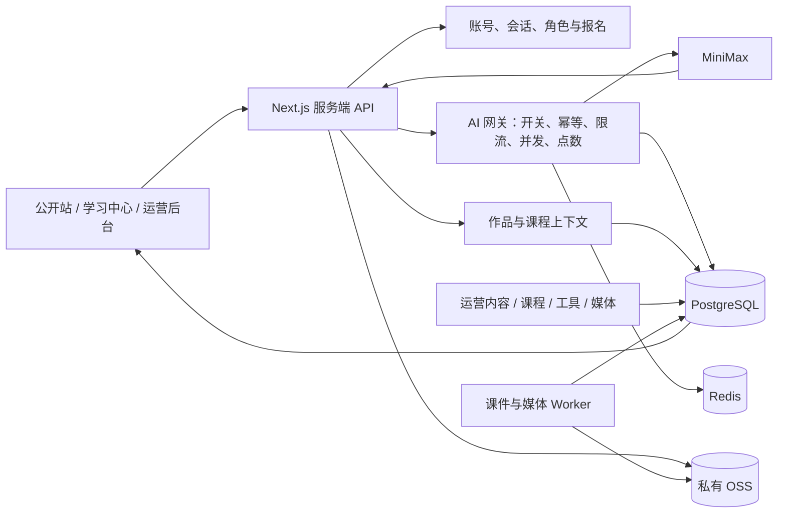

# 科瑞特 AI 生产化前后端对接与全功能验收基线

> 状态：`ACTIVE / 生产化主文档`
> 审计日期：2026-09-06
> 应用目录：`D:\programe\AI科瑞特\AI-create`
> 生产域名：`https://lingpeak.com`
> 本文不记录任何真实密码、密钥或学生资料。

## 1. 当前结论

现有项目已经具备完整度较高的服务端底座：PostgreSQL/Prisma 数据模型、Redis 限流、账号与会话、权益和点数、统一 AI 网关、个人作品、课程和学习中心、运营后台、私有课件、媒体处理、审计与版本记录均有对应代码。

当前版本仍不能直接作为“所有功能真实可用”的生产版本发布。2026-09-05 的代码审计发现，最新视觉整改使用的 `reference-*` 页面与原有数据层发生了脱节；AI 编程和 AI 阅读的公开工作台仍包含关键 Mock 行为；AI 音乐、阅读和部分绘画历史依赖浏览器存储。项目负责人已确认阿里云 RDS 已购买、OSS Bucket 已创建，但连接参数、最小权限、网络访问、Secret 注入和真实读写尚未验收；Worker 与转换工具也尚未在当前环境配置。上线前必须先完成本文 P0 项并通过完整预发布验收。

### 1.1 状态定义

| 状态 | 含义 |
|---|---|
| 已验证 | 当前本地环境已执行并得到成功结果 |
| 代码具备 | 接口、模型或页面存在，但缺少有权限账号、真实内容、供应商或生产基础设施验证 |
| 部分可用 | 主链路存在，仍有本地状态、静默失败或契约不统一 |
| Mock/阻断 | 页面展示为可操作功能，但实际没有完成声明的业务行为 |
| 外部待办 | 需要生产 Secret、云资源、真实账号、授权素材或运营决策 |

## 2. 本轮验证证据

### 2.1 已通过

- PostgreSQL 16 容器 `krt-postgres`：healthy。
- Redis 7 容器 `krt-redis`：healthy。
- Prisma schema：`npx prisma validate` 通过。
- 数据库迁移：共 9 项，`npx prisma migrate status` 显示 up to date。
- 单元测试：19 个测试文件、39 项测试全部通过。
- 凭据扫描：1375 个源码/配置文件通过。
- 本轮生产构建：Next.js 16.3.4 构建通过，生成 103 个静态页面并列出完整动态路由。
- ESLint：0 个错误、29 个既有 warning；主要是旧工具页面的原生 `` 与后台 Hook 依赖提示，后续改相关组件时一并消除。
- HTTP 链接爬取：从 10 个核心入口递归检查 51 个实际可达站内页面，全部返回 200；历史别名按设计返回 307/308。
- 未登录权限：`/api/works`、`/api/admin/accounts`、`/api/admin/courses` 返回 401。
- 匿名 AI：`/api/ai/trial` 正常返回剩余额度；未确认访客试用时，五个 MiniMax 入口均返回 401 和试用确认地址。
- 咨询接口空载荷返回 400，没有写入脏数据。

### 2.2 当前数据库事实

审计时数据库共有 4 个账号、1 个启用管理员、6 个 AI 工具且均启用。课程、已发布课程、有效作品、咨询、媒体和课件数量均为 0。因此，本轮只能验证空状态和权限边界，不能据此认定课程发布、报名学习、真实课件、媒体转码、后台写入和 AI 生成已经完成端到端验收。

### 2.3 尚未完成的动态验收

- 注册接口在审计期间触发每小时限流，返回 429；未通过篡改或清空限流数据规避保护。
- 缺少本轮可使用的临时管理员、个人学员和学校共享账号，未执行带权限的后台写入闭环。
- 未实际调用付费 MiniMax 生成，避免在点数权重、生产开关和供应商契约未确认时消耗额度。
- 当前课程、报名、课件和媒体数据为空，无法完成学习中心、课程上下文、预览水印和媒体播放的真实数据验收。
- 阿里云 RDS 已购买、OSS Bucket 已创建，但当前应用尚未获得并验证生产连接与访问配置；LibreOffice、FFmpeg、Redis 生产资源和 Worker Token 状态仍待确认，现有预检不能通过。

## 3. 生产链路目标



生产实现必须坚持一个事实来源：运营内容和个人作品以数据库与私有对象存储为准；浏览器存储只用于学校共享账号的当堂临时工作区，以及明确标注的未提交草稿。

## 4. 上线阻断项

### P0-1：视觉整改页面没有完整接回 CMS 和运营数据

当前 `/`、`/about`、`/courses`、`/activities` 等入口直接渲染 `ReferenceHome`、`ReferenceAbout`、`ReferenceCourses`、`ReferenceActivities`。这些组件把标题、课程方向、活动、电话、图片和链接写在源码中，没有读取 `SitePage`、`PageSection`、`MediaSlot`、`Course`、`Activity`、`Achievement` 或后台 AI 工具目录。

影响：运营人员在 `/admin/site-pages`、`/admin/content`、`/admin/courses`、`/admin/media-slots` 或 `/admin/ai-tools` 保存并发布后，最新视觉页面不会完整更新。当前后台文案“发布后前台立即读取”与实际页面行为不一致。

必须完成：保留现有视觉和动效，把数据读取放回服务端页面或服务端容器组件；`reference-*` 组件改为接收经校验的 props。数据库不可用时只能使用经过授权的品牌基线，不得用虚构课程、活动、师资或成果填充。

### P0-2：AI 编程公开工作台是规则演示，不是真实 AI 编程

`src/components/reference-programming.tsx` 的运行逻辑仅检查源码是否包含几个固定字符串，然后显示固定的 10 步迷宫路径；页面不调用 `/api/minimax/code`，历史只写 `robot_maze_works` 本地存储。旧的 `/ai-programming` 又重定向到该公开工作台，使原先已接 `/api/minimax/code` 和 `/api/works` 的页面无法成为主入口。

必须完成：把现有界面接到受网关保护的代码生成接口；生成结果使用受限 iframe/解释器执行，错误必须来自真实解析或运行；个人账号保存为 `WorkType.CODE`，学校账号只保留当堂临时数据；删除固定成功结果和伪控制台输出。

### P0-3：AI 阅读的“智能拆分”和结果页是固定故事

`ReferenceReadingImport` 点击开始后只把输入写到 `reading_import`，等待 350ms 后跳转。`ReferenceReadingStory` 不读取该输入，始终显示源码中的六段“小蚂蚁搬苹果”，AI 老师消息也是固定文本。`.docx` 使用 `FileReader.readAsText`，不能正确解析 Word 文档。

必须完成：新增或复用受网关保护的服务端分析契约，真实完成文本清洗、分段、结构、问题和证据定位；结果页必须读取本次分析结果；DOCX 使用项目现有 `mammoth` 在服务端或受控客户端解析；个人账号将阅读项目保存为 `WorkType.READING` 的 JSON 资产，学校账号仅保存当前课堂会话。

### P0-4：AI 音乐没有进入云端作品库

`ReferenceMusic` 会调用 `/api/minimax/chat` 与 `/api/minimax/music`，但曲目和收藏仅保存在 `ai_music_tracks`、`ai_music_favorites`。它没有调用 `/api/works`；远端音频 URL 可能过期，跨域下载也可能忽略 `download` 文件名。

必须完成：服务端在生成成功后受控拉取或接收音频、校验 MIME/大小并写入私有存储，创建 `WorkType.MUSIC`；前端历史、收藏、删除、下载均以作品 API 为准。收藏如需长期存在，应建字段或独立关系，不能继续只存浏览器。

### P0-5：作品存在双状态和静默失败

AI 绘画已经尝试调用 `/api/works`，但 UI 历史仍以 `ai_art_works` 为准，云端保存失败只给临时提示；只有 Base64 图片会进入 `cloudSave`。`/my-works` 同时展示服务端作品和本地旧绘画数据，容易重复或状态不一致。

必须完成：个人账号生成成功后，由统一保存服务返回 `workId`、资产状态和下载地址；失败应提供明确重试。首次升级可提供一次本地作品迁移，成功后删除对应本地记录。学校账号维持 12 小时 `sessionStorage` 规则，不调用云端作品接口。

### P0-6：工具目录后台与公开工具页脱节

数据库有 6 个启用工具，公开 `/tools` 源码只展示 4 个；公开层没有对应的工具目录读取接口。管理员修改名称、说明、排序、封面、公开可见性或全局状态后，目录页和入口不会同步。网关仍会在调用前检查启停，因此会出现“页面能点但接口拒绝”或“后台已发布但页面不显示”。

必须完成：新增只返回 `ACTIVE + visibleToPublic` 白名单字段的公开工具目录接口，或在服务端页面直接读取目录；路由继续由服务端白名单决定，后台不得创建任意代码路径。

### P0-7：生产基础设施已部分采购，但尚未完成接入与验证

项目负责人已确认阿里云 RDS 已购买、OSS Bucket 已创建。当前课件预检结果仍是：`STORAGE_DRIVER` 不是 OSS、OSS 四项必需配置缺失、`COURSEWARE_WORKER_TOKEN` 缺失、LibreOffice 不可用。当前环境同样缺少生产 `DATABASE_URL`、`REDIS_URL`、`MEDIA_WORKER_TOKEN`、`FFMPEG_PATH`。云资源“已创建”不等于应用“已接入”；必须完成 VPC/白名单、最小权限、Secret 注入、迁移、读写和备份恢复验证。

已在本轮补齐 `.env.example` 与 `.env.platform.example` 的变量名称和安全默认值，但真实值必须从部署平台 Secret 注入。生产初始值保持 `AI_GENERATION_ENABLED=false`。

### P0-8：缺少真实角色与内容的端到端测试

39 项现有测试均为单元/策略测试，没有浏览器 E2E，也没有覆盖注册、登录、管理员内容发布、个人报名学习、学校课堂、四类 AI 工具、云端作品和生产 Worker 的完整链路。

必须建立稳定的预发布测试数据和 Playwright（或等价）测试，覆盖管理员、个人学员、学校共享账号和匿名访客；测试结束清理创建的数据与对象。

## 5. 前后端接口对接矩阵

| 业务 | 前端入口 | 服务端接口/数据 | 当前状态 | 生产对接要求 |
|---|---|---|---|---|
| 会话 | 全站导航、登录 | `/api/auth/session` | 代码具备 | 首屏避免闪烁；401、停用、过期统一处理 |
| 个人登录 | `/login` | `POST /api/auth/login` | 代码具备 | 验证成功、失败、限流、Cookie、退出和续登 |
| 社会注册 | `/register` | `POST /api/auth/register` | 代码具备，动态验收受 429 阻断 | 建临时账号完整验收；确认免费计划和点数策略 |
| 培训注册 | `/register?invitationCode=` | `POST /api/auth/register/training` | 代码具备 | 验证邀请码有效期、人数、组织、班级和事务回滚 |
| 学校登录 | `/login?mode=school` | 同登录接口 | 代码具备 | 验证 12 小时会话、退出清理、禁止云端作品 |
| 课程目录 | `/courses` | `/api/public/course-categories`、`/api/public/courses` | 后端具备，视觉页未接 | 后台发布后页面即时反映；草稿不可见 |
| 课程详情 | `/courses/[slug]` | `/api/public/courses/[courseSlug]` | 同时存在静态方向页与数据库课程 | 明确静态“课程方向”和可报名课程的 URL/Slug 规则，避免冲突 |
| 学习中心 | `/learn/**` | `/api/me/courses/**`、`/api/me/learning-dashboard` | 代码具备，数据库无课程 | 用有效/过期报名和已发布/草稿课时验收 |
| 课时进度 | 课时页 | `POST .../progress` | 代码具备 | 验证完成/撤销、课程总进度、越权拒绝 |
| 课程公告 | 学习课程页 | 管理员公告 API + `/api/me/courses/[courseId]` | 代码具备 | 验证发布时间、下线和报名隔离 |
| 课件 | 后台上传、学员预览 | `/api/admin/courseware/**`、`/api/me/courseware/**` | 代码具备，环境未就绪 | OSS + LibreOffice + Worker + 真实多格式验收 |
| AI 工具目录 | `/tools`、后台工具页 | `/api/admin/ai-tools/**`、`AiTool` | 网关读取，公开 UI 未接 | 增加公开只读契约并统一路由、开关、名称、排序和封面 |
| AI 绘画 | `/tools/ai-art` | `/api/minimax/image`、`/api/works` | 部分可用 | 统一请求/结果/作品保存；验证图生图官方参数 |
| AI 音乐 | `/tools/ai-music` | `/api/minimax/chat`、`/api/minimax/music` | 生成部分可用，作品未接 | 音频入私有存储并创建 MUSIC 作品，处理 URL 过期 |
| AI 编程 | `/tools/ai-programming` | 应接 `/api/minimax/code`、`/api/works` | Mock/阻断 | 使用真实生成和受限执行环境，保存 CODE 作品 |
| AI 阅读 | `/tools/ai-reading/**` | 应接 `/api/minimax/chat`、`/api/minimax/vision`、`/api/minimax/image`、`/api/works` | Mock/阻断 | 真实拆分/提问/证据/绘本，保存 READING 项目 |
| 作品中心 | `/my-works` | `/api/works/**` | 后端具备，前端混用本地数据 | 统一云端列表、下载、删除、课程归属和配额提示 |
| 咨询 | `/consult`、校园合作 | `/api/public/inquiries`、`/api/admin/inquiries/**` | 代码具备 | 用测试线索验收状态流转和审计后清理 |
| 页面 CMS | `/admin/site-pages` | `/api/admin/site-pages/**` | 后台具备，视觉页未接 | 所有声明受管的区块必须读取已发布版本 |
| 内容 CMS | 活动、成果、师资、校区、合作方 | `/api/admin/content/**`、公开内容查询 | 后端具备，视觉页大多硬编码 | 发布、下线、图集、版本恢复在前台即时生效 |
| 媒体 | 后台媒体库、公开页面 | `/api/admin/media/**`、`/api/media/**` | 代码具备，环境未就绪 | OSS、FFmpeg、海报、字幕、下线、缓存与审计验收 |
| 报名 | 后台、学习中心 | `/api/admin/enrollments/**` | 代码具备 | 单条和批量导入、原子失败、有效期、课程访问验收 |
| 学校/培训 | 后台总览 | schools/training/invitations API | 代码具备 | 临时学校、组织、班级、邀请码全链路验收 |
| 套餐/订单/点数 | 后台总览、AI 网关 | plans/orders/ai-settings API | 代码具备 | 成本权重、预占/结算/释放、人工开通和审计验收 |

## 6. 建议统一的 AI 请求与作品契约

当前 MiniMax 路由返回供应商风格的数据，图片、音乐、聊天和代码字段不一致。生产前建议在服务端适配为稳定的站内契约，前端不再读取供应商原始字段。

### 6.1 请求公共字段

```json
{
  "clientRequestId": "UUID，与 Idempotency-Key 一致",
  "toolKey": "image | music | code | reading",
  "courseId": "可选，由服务端再次校验",
  "lessonId": "可选，由服务端再次校验",
  "input": {}
}
```

请求必须带 `Idempotency-Key`。课程上下文只能作为提示，服务端仍需验证报名、课程/课时发布状态和工具绑定。

### 6.2 成功响应

```json
{
  "requestId": "服务端请求 ID",
  "status": "SUCCEEDED",
  "result": {
    "kind": "IMAGE | MUSIC | CODE | READING",
    "preview": {},
    "workId": "个人账号保存成功后返回；学校/匿名为空"
  },
  "credits": {
    "charged": 0,
    "balance": 0
  }
}
```

### 6.3 错误响应

```json
{
  "requestId": "存在时返回",
  "error": {
    "code": "UNAUTHENTICATED | TRIAL_CONSENT_REQUIRED | TOOL_DISABLED | RATE_LIMITED | INSUFFICIENT_CREDITS | PROVIDER_FAILED | STORAGE_FAILED",
    "message": "给用户看的中文说明",
    "retryable": false
  }
}
```

所有 API 应统一使用该语义；不得让前端通过中文字符串猜测错误类型。

## 7. 各 AI 工具真实化要求

### 7.1 绘画

- 文生图和图生图均需以 MiniMax 当前官方接口实测；现有代码中的 `reference_image` 仍带“可能/方案”注释，不能视为已验证。
- 服务端校验文件签名、尺寸、像素和 MIME；不要只信 data URL 声明。
- 生成成功与作品存储应形成可恢复状态。供应商成功而存储失败时，保留 `requestId` 并提供重试，不重复扣点。
- 历史、删除、下载、课程归属统一读取作品 API。

### 7.2 音乐

- 兼容同步结果和异步任务查询，明确何时使用 `/api/minimax/music/query`。
- 服务端把供应商音频复制到私有 OSS，避免临时 URL 失效。
- 保存歌词、提示词、模型、时长等元数据时不得把敏感全文写入普通日志。
- 收藏、版本和“继续编辑”的数据结构需落库或降级为明确的本地草稿。

### 7.3 编程

- 公开工作台调用真实代码生成 API，删除固定结果。
- HTML 预览 iframe 至少使用 `sandbox`，不得允许生成内容访问父页面 Cookie、同源存储或后台接口。
- Scratch/Python/C++ 若宣称可运行，必须选择真实执行方案；没有运行时的语言只能提供生成、静态检查和下载，文案要如实说明。
- 保存为 CODE 作品，支持查看源码、预览和下载。

### 7.4 阅读

- 导入端支持粘贴、TXT、MD、DOCX；DOCX 必须真实解析。
- 服务端返回可验证 JSON：标题、摘要、段落、结构节点、关键词、引导问题、证据引用和难度。
- 每次问答使用当前文章、段落与教师指引，不能复用固定小蚂蚁回复。
- 绘本图片要关联段落，支持失败重试、统一画风和断点恢复。
- 项目保存为 READING 作品；避免把 20,000 字正文塞入 URL 或日志。

## 8. 认证、权益与角色验收

### 8.1 匿名访客

- 首次生成前明确确认试用。
- 每工具每日次数、设备标识、时区和 Redis 限流有效。
- 匿名结果不进入个人作品、课程或账号数据。

### 8.2 个人与培训学员

- 注册事务同时创建账号、权益、钱包和审计，任一步失败全部回滚。
- 邀请码验证有效期、名额、组织/班级与重复领取。
- 登录后个人作品进入云端；免费用户 200MB 和 30 天规则真实生效。
- 密码找回、手机号验证和在线支付仍未实现，不得在页面宣称可用。

### 8.3 学校共享账号

- 仅开放学校配置允许的工具，服务端强制执行。
- 不创建学生身份，不上传作品；浏览器数据在退出或 12 小时后清理。
- 30/60 人并发、成本告警和紧急暂停必须压测。

### 8.4 管理员

- 页面外壳可以返回 200，但所有数据和写操作必须由服务端 `SUPER_ADMIN` 校验。
- 内容、工具、课程、报名、媒体、套餐、学校、培训、订单和密码重置均写审计。
- 上线前重置任何曾在非受控渠道出现过的密码并撤销旧会话。

## 9. 生产环境变量

权威模板为应用目录下 `.env.platform.example`。必需类别如下：

| 类别 | 变量 |
|---|---|
| 数据 | `DATABASE_URL`、`REDIS_URL` |
| 站点 | `NEXT_PUBLIC_SITE_URL` |
| AI | `MINIMAX_API_KEY`、`MINIMAX_GROUP_ID`、`MINIMAX_BASE_URL`、`AI_GENERATION_ENABLED` |
| AI 治理 | `AI_CONCURRENCY_PER_ACCOUNT`、`AI_REQUESTS_PER_MINUTE`、`AI_TRIAL_TIMEZONE`、`KRT_AI_REQUEST_TIMEOUT_MINUTES`、`KRT_AI_REQUEST_RECOVERY_BATCH_SIZE` |
| 私有存储 | `STORAGE_DRIVER=OSS`、`OSS_BUCKET`、`OSS_ENDPOINT`、`OSS_ACCESS_KEY_ID`、`OSS_ACCESS_KEY_SECRET`、可选 `OSS_SECURITY_TOKEN` |
| 课件 | `COURSEWARE_WORKER_TOKEN`、`COURSEWARE_UPLOAD_MAX_BYTES`、`COURSEWARE_CONVERSION_TIMEOUT_MS`、`SOFFICE_PATH` |
| 媒体 | `MEDIA_WORKER_TOKEN`、`MEDIA_VIDEO_UPLOAD_MAX_BYTES`、`MEDIA_PROCESSING_TIMEOUT_MS`、`FFMPEG_PATH` |
| 一次性管理 | `KRT_BOOTSTRAP_ADMIN_*`、`KRT_ADMIN_PASSWORD_RESET_*`，正常运行时留空 |

旧文档曾列出 `APP_URL` 和 `SESSION_SECRET`。当前源码只在 sitemap/robots 使用 `NEXT_PUBLIC_SITE_URL`，当前数据库随机会话令牌实现也没有读取 `SESSION_SECRET`。除非后续代码明确使用，不要把未消费的变量当作已生效安全控制。

## 10. 分阶段实施顺序

1. **恢复动态数据通道**：为最新视觉组件定义 props，接回 CMS、媒体位、课程、活动、成果和工具目录；保持现有视觉快照不回退。
2. **去除核心 Mock**：先完成编程和阅读，再统一绘画、音乐和作品中心。
3. **统一 AI 契约**：供应商适配、幂等、状态、错误码、点数和作品保存形成单一服务层。
4. **建立预发布数据**：创建临时管理员、个人学员、学校账号、课程、课时、公告、工具绑定、报名、课件、媒体和咨询。
5. **接入生产基础设施**：RDS/Redis/OSS、LibreOffice、FFmpeg、Worker、定时回收和生命周期任务。
6. **自动化 E2E 与压测**：四种身份、四类 AI 工具、后台发布、学习、课件、媒体、作品、权限与并发。
7. **灰度上线**：AI 默认关闭，先单工具、小账号范围验证成本和失败恢复，再逐步开放。

## 11. 上线验收门禁

以下条件全部满足，才能使用“所有功能真实可用”的结论：

- `npm test`、`npm run lint`、`npm run security:scan`、`npm run build` 全部通过，无新增错误。
- 站内链接爬取和 Playwright 桌面/移动测试通过。
- 后台发布/下线页面区块、课程、活动、成果、工具和媒体后，公开端无需改代码即可同步。
- 注册、登录、退出、停用、过期、培训邀请码和学校共享账号均通过真实数据库测试。
- 四个公开 AI 工具不再用固定结果冒充生成；成功、失败、取消、超时、重复点击和刷新恢复均验证。
- 个人作品的创建、列表、课程归属、下载、删除、容量、到期和清理通过；学校账号没有云端作品。
- 点数预占、结算、失败释放、超时回收、并发、分钟限流和全局停用通过。
- 真实 PPT/PPTX/DOC/DOCX/PDF/图片/视频课件完成私有预览、水印、过期和越权检查。
- 真实授权 MP4/WebM 完成转码、海报、字幕、下线和公开播放测试。
- RDS 备份恢复、OSS 生命周期、日志脱敏、监控告警、Nginx 80/443 与应用内网端口验证完成。
- 所有测试账号、测试数据和临时对象完成清理，审计记录按策略保留。

## 12. 开工资料门禁和当前实施边界

2026-09-06，项目负责人已明确回复“资料已齐，可以开工”。阶段 0 已通过，不再重复收集。资源和决策的详细状态以《科瑞特AI生产化资料门禁确认记录》为准。

当前允许完成本地代码、本地 PostgreSQL/Redis/LOCAL 存储集成、合成验收数据和本机预发布验收。生产 RDS 连通与迁移、OSS RAM Role 真实读写、ECS Redis、LibreOffice/FFmpeg Worker、Worker Token、Nginx 发布、监控与备份恢复、30/60 并发仍属阶段 F 外部阻断。不自动创建付费云资源，不发布正式生产，不删除生产数据或 OSS 对象。

## 13. 阶段 A 实施记录

2026-09-06 已完成回归基线：

- 保留原有大规模视觉改动、未跟踪文件和有意删除；未使用 reset/checkout，未自动清理可疑目录。
- `npm test`：21 个测试文件、54 个测试全部通过。Vitest 已明确排除 Playwright `e2e` 目录。
- `npm run lint`：0 错误，29 警告；警告为已有 `` 优化和 Hook 依赖项，不写为零缺陷。
- `npm run security:scan`：1387 个源码/配置文件通过凭证扫描。
- `npm run build`：Next.js 16.3.4 生产构建通过，生成 103 个静态页面。构建期生产数据库占位连接不可达，公开内容 loader 记录 Prisma 错误后走安全 fallback；这不等于生产 RDS 已验证。
- 路由契约生成 69 个 `page.tsx` 和 83 个 `route.ts` 清单，重复/形状冲突检查通过。课程方向使用 `/courses/directions/[slug]`，10 个旧静态 slug 返回 308。
- Playwright 对 standalone 生产构建运行，桌面和 Pixel 7 两个项目共 22 个用例通过，覆盖公开主页、四工具入口、登录、注册、咨询、学习/作品未登录状态和后台/API 鉴权。产物位于 `D:\.codex\AI-create\playwright`。
- `npm run fixtures:generate` 可重复生成并验证 13 个合成文件：TXT、MD、DOC、DOCX、PPT、PPTX、PDF、JPG、PNG、WebP、MP4、WebM、WebVTT。全部使用虚构人物/学校与 `AUTOMATED_SYNTHETIC_TEST_DATA` 标记，生成结果和 SHA-256 清单位于 `D:\.codex\AI-create\synthetic-fixtures`；`npm run fixtures:clean` 的定向清理与再生成已通过。
- DOCX、PDF、PPTX 和图片已逐页/原尺寸目视，未见裁切、重叠或缺字。当前捆绑工作区未提供 LibreOffice，DOCX 视觉 QA 使用本机 Word 导出 PDF 后再用捆绑 Poppler 渲染；生产 LibreOffice Worker 仍未验证。

## 14. 文档治理

本文件取代旧的“视觉整改执行看板”和散落的生产待办，作为下一阶段生产化工作的主入口。业务身份和商业规则仍以归档的《科瑞特AI平台用户分级与商业化规划》为参考，但其中的历史“已完成”陈述必须以当前代码和本文件验收结果复核。旧部署指南包含已经过时的公网 3000 端口和不一致 IP，不能继续直接执行。

## 15. 阶段 B-E 本地实施状态（2026-09-07）

### 阶段 B：公开站与后台真实数据通道

- 首页、课程、活动、成果、咨询、合作与工具目录使用受类型约束的 loader/props；数据库为空、数据库故障、草稿不可见和品牌授权 fallback 分开表达。
- 公开媒体只解析 `ACTIVE + READY` 对象；课程封面优先于分类封面；保留课程方向 slug 在后台写入前返回 409。
- 公开 AI 工具接口只返回代码白名单内的 `ACTIVE + visibleToPublic` 字段。`reading` 已从内部 `vision` 拆为独立权限、费用和课程绑定键。
- 课程、内容、页面区块、媒体位、媒体对象和 AI 工具变更均触发对应路径失效。机器路由契约为 69 个页面源、90 个 Route Handler，无碰撞且清单无漂移。

### 阶段 C：AI 契约、状态与作品

- image/music/code/reading 前端只消费站内 `status/result.kind/result.preview/requestId`，不再消费 MiniMax 原始 `choices/data/trace_id`。
- `AiRequest + AiJob` 支持排队、供应商等待、持久化、重试、恢复、取消等状态；请求指纹处理相同/冲突幂等键；状态查询只允许请求所有者。
- 点数账本引用、UsageEvent 请求引用唯一；结算使用状态 CAS；Redis 并发使用带 token 的 ZSET lease，不再用可重复 DECR。
- 个人音乐由服务端受控拉取、MIME/大小/SSRF 校验后存储；作品容量用串行化事务处理；对象失败补偿；作品支持收藏、版本链和来源请求。
- 旧 `music_query` 任意任务查询已返回 410，避免任务 ID 越权；异步恢复通过站内请求状态接口完成。
- 生产默认仍为 `AI_GENERATION_ENABLED=false`。2026-09-07 已在本机用当前 MiniMax 配置完成最小真实调用；结果见第 18 节。真实成本权重、生产开关及供应商端持续稳定性仍须在 Stage F 灰度实测。

### 阶段 D：四工具真实化与存储边界

- 编程工作台真实调用 code API，仅承诺 HTML；结果在 `sandbox="allow-scripts"` 且无 same-origin 的 iframe 中运行，不再显示固定路线或假控制台。Python/C++/Scratch 未提供运行时，不宣称可执行。
- 阅读真实执行中文结构化分析、分块合并、问题/证据/难度校验；TXT/MD/DOCX 通过服务端提取 API 统一执行 50 MiB、50,000 字和中文限制，DOC 在 LibreOffice Worker 未就绪时明确返回 503。
- 绘画和音乐工作台使用稳定响应、真实失败状态和请求编号；个人作品保存必须成功才显示云端成功，失败可按请求编号重试。
- 工具存储身份来自服务端 `/api/auth/session`：个人使用云端及明确草稿，学校使用 12 小时 `sessionStorage`，匿名使用临时 session；新主链路不读取可修改账号类型 Cookie。
- 作品中心保留一次性旧绘画记录迁移，成功后删除对应旧记录，失败保留重试。

### 阶段 E：角色与数据闭环

- 可重复 seed/clean 脚本创建虚构管理员、个人、学校、培训、停用账号、过期会话、组织/班级/邀请码、套餐/钱包、课程/模块/课时/公告/工具绑定/报名/活动/成果。
- Playwright 在 production standalone、本地 PostgreSQL、隔离 Redis 和 LOCAL 存储下最终结果为 29 passed、7 skipped、0 failed。7 项跳过是移动端重复执行会改变共享数据的角色用例；同一角色链已在桌面真实执行。公开页和权限只读用例同时覆盖桌面与 Pixel 7。
- 真实验证包括：后台服务端阻断、管理员关键 API、个人/学校越权差异、停用与错误登录模式、过期会话、培训邀请码事务注册、个人报名课程、公告和课时进度写入至 100%、liveness/readiness。
- 清理后 `ACC_` 账号、`acc-` 课程、活动和成果计数均为 0，凭据状态文件删除，隔离 Redis 容器删除；验收审计按策略保留。

## 16. 2026-09-07 最终本地质量门禁

- `npm test`：32 files / 91 tests passed。
- `npx tsc --noEmit`：通过。
- `npm run lint`：0 errors / 29 warnings；警告均为既有 `` 建议和 Hook 依赖建议，未冒充零缺陷。
- `npm run security:scan`：1423 个源码/配置文件通过凭据扫描。
- `npm run routes:check`：70 pages / 93 route handlers，通过。
- `npm run build`：Next.js 16.3.4 通过，111 个静态页面。本轮显式使用本地 PostgreSQL 与隔离 Redis 构建，避免把生产占位 RDS 的 fallback 当作数据库验收。
- Prisma：13 个迁移已在本地 PostgreSQL 应用并显示 up to date；最新迁移为 `20260907100000_split_reading_tool`。
- Dockerfile 已切换 `npm ci`、构建期生成 Prisma Client、非 root runner 和 readiness healthcheck；Compose 仅绑定 `127.0.0.1:3000`。镜像实构两次均因 Docker Hub OAuth `EOF` 无法拉取 `node:20-alpine`，因此镜像构建未记为通过。

## 17. 唯一剩余阶段：F 真实生产基础设施验收

阶段 A-E 的已确认本地/本机预发布范围完成。仍未完成且不得宣称通过的范围为：生产 RDS 真实连通、迁移账号与运行账号最小权限；ECS RAM Role 临时凭据与私有 OSS 真实读写/生命周期；ECS Redis；LibreOffice/FFmpeg 独立 Worker 与 Token；Docker 镜像在可用 Registry 环境实构；Nginx 发布；监控告警；备份恢复；真实授权多格式课件/媒体链路；MiniMax 小流量付费灰度、成本权重；30/60 并发及失败恢复。当前 2C2G ECS 不作为最终并发验收环境，不自动扩容、不自动发布、不写生产数据。

## 18. 真实 AI 供应商本地验收（2026-09-07）

- AI 编程：真实 MiniMax 文本调用返回 200，单文件 HTML 可被站内契约提取并在 sandbox 预览；兼容模型返回的 `<think>` 推理段，不向前端暴露内部推理。
- AI 阅读：真实结构化分析返回 200，得到标题、5 个关键词、3 个分段及结构信息；修复原分块正则中下划线导致文章无法分块的问题，并为无效结构化响应增加一次校正重试。
- AI 绘画：真实 MiniMax 图片生成返回 200，站内稳定契约为 `IMAGE`，返回可显示的数据 URL。
- AI 音乐：当前账户被 MiniMax 以 HTTP 410、供应商码 2153 拒绝，含义为音乐 API 不再向新用户开放；站内现返回明确的 503 `PROVIDER_UNAVAILABLE` 且 `retryable=false`。在配置可用的音乐供应商或具备存量 Music API 权限的账户前，不得宣称音乐生成可用。
- 回归门禁：Vitest 32 files / 91 tests、TypeScript 和 ESLint 全部通过；管理员会话保持基线要求的 8 小时。
